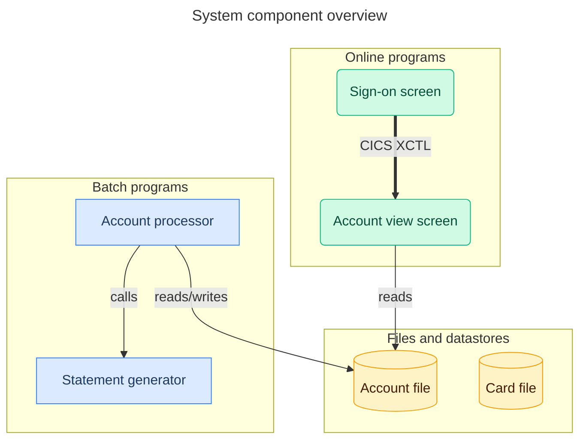
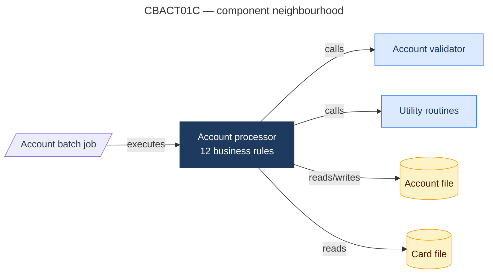
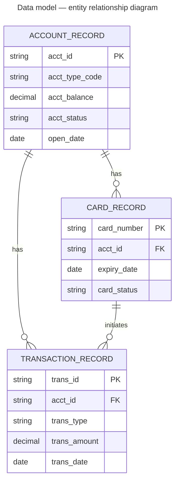

# Skill — component mapper

## Purpose

Translate the structural topology of the codebase — call graph, file
relationships, data entities — into Mermaid diagram definitions. Produce
diagrams that show what exists and how it connects, at both system and
program level.

Do not add information not present in the source artifacts. Render what
the inventory, parser, data, and rules agents found.

---

## Diagram 1 — system component overview

### Source data

- `inventory_artifact.json` → `call_graph.nodes`, `call_graph.edges`,
  `jcl_registry`
- `parser_artifact.json` → `programs[].subtype` (batch vs online)
- `rules_artifact.json` → `rules_by_program` (to annotate rule counts)

### Node classification and styling

Assign Mermaid node shapes and CSS classes by program type:

| Type | Mermaid shape | Class |
|---|---|---|
| Batch program | Rectangle `[label]` | `:::batch` |
| Online (CICS) program | Rounded rectangle `(label)` | `:::online` |
| Copybook | Parallelogram `[/label/]` | `:::copybook` |
| VSAM file / dataset | Cylinder `[(label)]` | `:::datastore` |
| External program (unresolved) | Hexagon `{{label}}` | `:::external` |
| JCL job | Trapezoid `[/label\]` | `:::jcl` |
| DB2 table | Database `[label]` | `:::db2` |

### Edge classification and styling

| Edge type | Mermaid syntax |
|---|---|
| `STATIC_CALL` | `A -->|calls| B` |
| `DYNAMIC_CALL` | `A -.->|dynamic call| B` |
| `CICS_LINK` | `A -->|CICS LINK| B` |
| `CICS_XCTL` | `A ==>|CICS XCTL| B` |
| `COPY` | `A -.->|includes| B` — only show in focused diagrams, not overview |
| `resolved: false` | `A -.->|? unresolved| B` |
| JCL executes program | `JOB -->|executes| PROGRAM` |
| Program reads file | `PROGRAM -->|reads| FILE` |
| Program writes file | `PROGRAM ==>|writes| FILE` |
| Program reads+writes | `PROGRAM <-->|reads/writes| FILE` |

File access direction is inferred from the OPEN mode recorded in the
Logic Agent's pseudocode:
- `OPEN INPUT` → reads
- `OPEN OUTPUT` → writes
- `OPEN I-O` → reads/writes
- `EXEC CICS READ` → reads
- `EXEC CICS WRITE/REWRITE/DELETE` → writes

### Size management

If `call_graph.nodes` count exceeds `MAX_NODES_PER_DIAGRAM`:
1. Compute node degree (in-edges + out-edges) for each node
2. Keep the top `MAX_NODES_PER_DIAGRAM` nodes by degree
3. For omitted nodes, add a summary node:
   `OMITTED["... and N more programs"]:::external`
4. Add a comment line at the top of the `.mmd` file:
   `%% Showing top 20 of 42 programs by connectivity`

### Subgraph grouping

Group nodes into Mermaid subgraphs by functional area:

```
subgraph BATCH["Batch programs"]
  CBACT01C CBSTM01A CBTRN01C ...
end

subgraph ONLINE["Online (CICS) programs"]
  COSGN00C COACT01C COCRDSLC ...
end

subgraph FILES["Files and datastores"]
  ACCTFILE CARDFILE TRANFILE ...
end

subgraph JCL["Batch jobs (JCL)"]
  ACCTJOB TRANSJOB ...
end
```

### Mermaid output template



---

## Diagram 2 — per-program neighbourhood

Generate one neighbourhood diagram per program in the top 10 most-connected
programs (by total edge count). Each diagram shows:
- The focal program at centre
- All direct callers (one hop in)
- All direct callees (one hop out)
- All files the program reads or writes
- Business rules count annotation on the focal node

Cap at `MAX_NODES_PER_DIAGRAM`. If the neighbourhood exceeds the cap,
show callers first, then callees, pruning the least-connected.

### Label annotation

Annotate the focal program node with a rule count badge in the label:

```
CBACT01C["Account processor\n📋 12 rules"]:::batch
```

If the program has `has_unstructured_flow: true` in the parser artifact:
```
CBACT01C["Account processor\n⚠ unstructured flow"]:::batch
```

### Mermaid output template



---

## Diagram 3 — ERD (entity-relationship diagram)

### Source data

- `data_artifact.json` → `data_model.entities`, `data_model.relationships`

### Entity rendering rules

Each entity in `data_model.entities` becomes an ERD entity block.
Include only the key fields (those ending in `-ID`, `-KEY`, `-NBR`, `-NO`)
plus fields marked `high_shared` — cap at 8 fields per entity to keep
the diagram readable.

For each field include:
- Field name (COBOL name, normalised: hyphens to underscores, lowercase)
- Normalised type
- `PK` marker for key fields
- `FK` marker for fields that appear in a `SHARED_KEY` relationship

### Relationship cardinality inference

Derive Mermaid crow's-foot notation from relationship type and field roles:

| Relationship type | Cardinality | Mermaid notation |
|---|---|---|
| `SHARED_KEY` (key field match) | One-to-many assumed | `\|\|--o{` |
| `FILE_BUFFER` | One-to-one | `\|\|--\|\|` |
| `REDEFINES_ALIAS` | One-to-one | `\|\|--\|\|` |
| `NAMING_CONVENTION` (low confidence) | Zero-or-one to many | `\|o--o{` |

If confidence is `low`, append `(unconfirmed)` to the relationship label.

### ERD size management

If `data_model.entities` count exceeds `MAX_NODES_PER_DIAGRAM`:
1. Keep all entities that have at least one relationship
2. Keep entities used by 3+ programs
3. Omit isolated low-usage entities with a summary comment

### Mermaid ERD output template



---

## Output index contribution

After generating all component and ERD diagrams, contribute entries to
`diagrams_artifact.json`:

```json
{
  "component_diagrams": [
    {
      "diagram_id": "COMP-OVERVIEW",
      "file": "diagrams/component_overview.mmd",
      "title": "System component overview",
      "type": "component",
      "node_count": 20,
      "edge_count": 45,
      "description": "Full system showing top 20 programs by connectivity"
    },
    {
      "diagram_id": "COMP-CBACT01C",
      "file": "diagrams/component_CBACT01C.mmd",
      "title": "CBACT01C component neighbourhood",
      "type": "component_neighbourhood",
      "focal_program": "CBACT01C",
      "node_count": 7,
      "edge_count": 6
    }
  ],
  "erd": {
    "diagram_id": "ERD-MAIN",
    "file": "diagrams/erd.mmd",
    "title": "Data model entity-relationship diagram",
    "type": "erd",
    "entity_count": 15,
    "relationship_count": 8
  }
}
```

---

## Error handling

| Condition | Action |
|---|---|
| Node in edge list not found in node list | Add node as `:::external` with ID only, log `warning` |
| Entity has no key fields | Use first field as implied PK, annotate `(implied)`, log `info` |
| ERD relationship confidence is low | Add `(unconfirmed)` label, log `info` |
| Subgraph would be empty | Omit the subgraph entirely, log `info` |
| Cyclic dependency between programs | Render as-is — Mermaid handles cycles; add `%% cycle detected` comment |
| Label contains Mermaid special characters (`()[]{}`) | Wrap label in double quotes, escape inner quotes |
| File access direction cannot be inferred | Default to `-->|accesses|`, log `info` |
