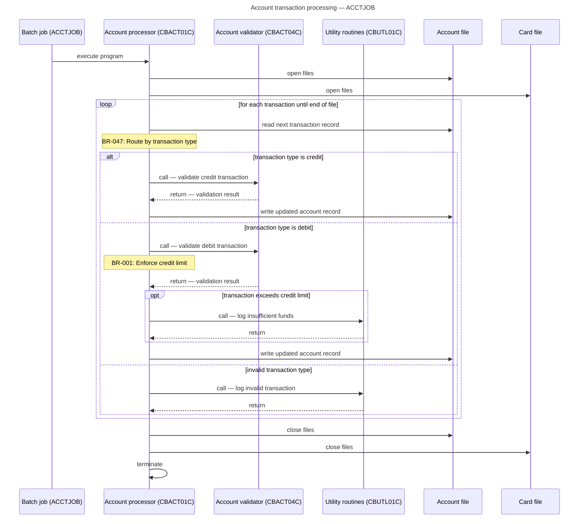
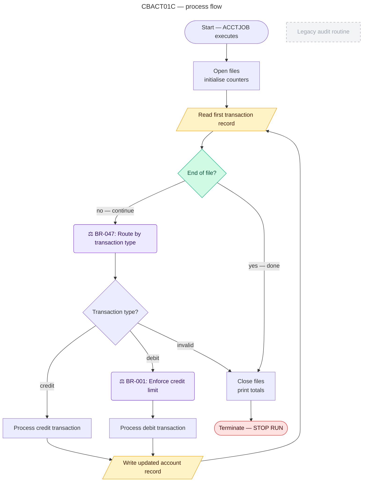

# Skill — sequence builder

## Purpose

Produce two types of Mermaid diagrams:

1. **Sequence diagrams** — for key end-to-end flows through the system
   (e.g. a credit card transaction from CICS screen to batch confirmation).
   Show which programs hand off to which, what data is passed, and what
   decisions are made at each step.

2. **Process flow diagrams** — one per program, showing the internal
   execution flow through paragraphs, with IF/EVALUATE branches, loops,
   and business rule callouts rendered as decision nodes.

Do not re-interpret logic. Render only what the Logic Agent and Rules
Agent produced.

---

## Diagram type 1 — sequence diagrams

### Flow identification

A key flow is an end-to-end process path that:
- Starts at a JCL job or CICS transaction entry point
- Crosses at least two program boundaries (CALL or CICS LINK/XCTL)
- Reaches a terminal statement (STOP RUN, CICS RETURN, GOBACK)

### Flow discovery algorithm

```
1. Load all JCL entry points from inventory_artifact.jcl_registry
2. Load all CICS transaction entry points (programs with CICS_LINK or
   CICS_XCTL incoming edges in call_graph)
3. For each entry point, walk the execution_traces in logic_artifact:
   a. Follow CALL edges to their callee programs
   b. Follow CICS_LINK and CICS_XCTL edges
   c. Record the chain: entry → prog1 → prog2 → ... → terminal
4. Deduplicate chains that share the same path
5. Select the top N flows by:
   - Chain length (prefer longer — more interesting)
   - Rule count along the chain (prefer rule-rich paths)
   - Presence of CICS interactions (prefer online flows)
   Cap at 8 flows total or until all entry points are covered
6. Name each flow using its entry point and terminal action:
   e.g. "Account transaction processing (ACCTJOB)"
        "Card sign-on flow (CC00)"
        "Credit card authorisation (CCAU)"
```

### Sequence diagram construction rules

**Participants** — one per program in the chain, plus datastores (files,
DB2 tables) that are accessed. Order participants left to right in
execution order.

**Participant labels** — use the program narrative summary from the Logic
Agent if available (first 5 words). Otherwise use the program ID with a
business-readable suffix.

**Messages** — represent each inter-program interaction as a Mermaid
message arrow:

| Interaction | Mermaid syntax |
|---|---|
| Static CALL (returns) | `ProgramA->>ProgramB: call — purpose` |
| Dynamic CALL | `ProgramA-->>ProgramB: dynamic call [?]` |
| CICS LINK (returns) | `ProgramA->>ProgramB: CICS LINK` |
| CICS XCTL (no return) | `ProgramA-xProgramB: CICS XCTL (no return)` |
| CICS SEND MAP | `ProgramA->>Terminal: display screen — screen name` |
| CICS RECEIVE MAP | `Terminal->>ProgramA: user input received` |
| File READ | `Program->>DataStore: read — file name` |
| File WRITE | `Program->>DataStore: write — file name` |
| SQL SELECT | `Program->>DB2: SELECT from table` |
| SQL INSERT/UPDATE | `Program->>DB2: INSERT/UPDATE table` |
| Return from CALL | `ProgramB-->>ProgramA: return — status` |
| STOP RUN | `ProgramA->>ProgramA: terminate` |
| CICS RETURN | `ProgramA->>CICS: CICS RETURN` |

**Business rule annotations** — for each CALL or significant decision in
the chain, if the Rules Agent identified a rule at that point, add a
`Note` in the sequence diagram:

```mermaid
Note over ProgramA: BR-001: Enforce transaction\namount limit
```

**alt/opt/loop blocks** — use Mermaid sequence diagram fragments for
major branching and looping:

```mermaid
alt transaction type is credit
  ProgramA->>CreditProcessor: CICS LINK
else transaction type is debit
  ProgramA->>DebitProcessor: CICS LINK
else invalid type
  ProgramA->>ErrorHandler: CICS LINK
end

loop for each record until EOF
  ProgramA->>DataStore: read next record
  ProgramA->>ProgramA: process record
end

opt account is overdrawn
  ProgramA->>OverdraftHandler: call
end
```

Use `alt` for IF/ELSE and EVALUATE with multiple significant outcomes.
Use `loop` for PERFORM UNTIL and PERFORM VARYING.
Use `opt` for IF with no ELSE (optional path).
Use `critical` for error handling paths that terminate processing.

**Size management** — if a flow has more than 30 messages, split into
sub-diagrams:
- Part 1: entry to midpoint (first major decision or program boundary)
- Part 2: midpoint to terminal
- Add a comment: `%% Continued in sequence_{FLOW-NAME}_part2.mmd`

### Mermaid sequence diagram output template



---

## Diagram type 2 — per-program process flowchart

Generate one process flowchart per program showing internal paragraph-level
execution flow with business rule callout nodes.

### Node types

| Content | Mermaid shape | Usage |
|---|---|---|
| Normal paragraph | Rectangle `[label]` | Standard execution step |
| Decision (IF/EVALUATE) | Diamond `{label}` | Branching point |
| Loop start (PERFORM UNTIL) | Hexagon `{{label}}` | Loop entry |
| File I/O operation | Parallelogram `[/label/]` | READ/WRITE/CICS I/O |
| External CALL | Subroutine `[[label]]` | Call to another program |
| Business rule | Rounded rect `(label)` | Named rule from rules_artifact |
| Terminal (STOP RUN) | Stadium `([label])` | Program termination |
| Dead code | Rectangle with class | `:::deadCode` styling |

### Edge labels

- Normal flow: no label (arrow only)
- THEN branch: `-->|yes / true|`
- ELSE branch: `-->|no / false|`
- WHEN clause: `-->|when 'CR'|` (use the value, not WHEN keyword)
- Loop continues: `-->|repeat|`
- Loop exits: `-->|done|`
- Error path: `-->|error|`

### Business rule annotation nodes

For each paragraph that has rules in `rules_artifact.rules_by_program`,
insert a rule callout node between the paragraph node and the next step:

```mermaid
PARA_0200["Process transaction"]
RULE_BR001("⚖ BR-001: Enforce credit limit")
PARA_0300["Update account balance"]

PARA_0200 --> RULE_BR001
RULE_BR001 --> PARA_0300
```

Only annotate rules with confidence `confirmed` or `high` inline.
Rules with `medium` or `low` confidence appear in a footnote comment
at the bottom of the `.mmd` file.

### Paragraph label generation

Convert paragraph names to readable labels using these rules:
- Strip leading digits and hyphens: `0200-PROCESS-TRANSACTION` → `Process transaction`
- Expand abbreviations using the same table from the rule-tagger skill
- Title case the result
- Cap label at 30 characters — truncate with `...` if longer

### Subgraph grouping by section

If the program has named sections in `procedure_division.sections`,
group paragraphs within their section using Mermaid subgraphs:

```mermaid
subgraph SEC_0000["Main control section"]
  PARA_0000 PARA_0100 PARA_0150
end

subgraph SEC_1000["Processing section"]
  PARA_1000 PARA_1100 PARA_1200
end
```

### Dead code styling

Paragraphs confirmed as dead code by the Logic Agent get a distinct style:

```mermaid
PARA_DEAD["Unused validation routine"]:::deadCode
%% Dead code — no incoming references detected
```

### Loop rendering

PERFORM UNTIL loops are rendered as a subgraph with a loop-back edge:

```mermaid
subgraph LOOP_0200["Loop: for each transaction"]
  LOOP_CHECK{"End of file?"}
  PARA_0200["Process transaction record"]
  LOOP_READ[/"Read next record"/]
end

LOOP_CHECK -->|no — continue| PARA_0200
PARA_0200 --> LOOP_READ
LOOP_READ --> LOOP_CHECK
LOOP_CHECK -->|yes — done| PARA_9000
```

### Size management

If the program has more than `MAX_NODES_PER_DIAGRAM` paragraphs:
1. Always include entry point and terminal paragraphs
2. Include all paragraphs with rules attached
3. Include all paragraphs with unstructured flow flags
4. Collapse remaining paragraphs into a summary node:
   `SUMMARY["... N internal paragraphs (see source)"]`

### Mermaid process flow output template



---

## Output index contribution

After generating all sequence and flow diagrams, contribute entries to
`diagrams_artifact.json`:

```json
{
  "sequence_diagrams": [
    {
      "diagram_id": "SEQ-ACCTJOB",
      "file": "diagrams/sequence_ACCTJOB.mmd",
      "title": "Account transaction processing — ACCTJOB",
      "type": "sequence",
      "entry_point": "ACCTJOB",
      "entry_type": "jcl",
      "programs_in_flow": ["CBACT01C", "CBACT04C", "CBUTL01C"],
      "message_count": 18,
      "rules_annotated": ["BR-001", "BR-047"]
    }
  ],
  "process_flow_diagrams": [
    {
      "diagram_id": "FLOW-CBACT01C",
      "file": "diagrams/flow_CBACT01C.mmd",
      "title": "CBACT01C — process flow",
      "type": "process_flow",
      "program_id": "CBACT01C",
      "node_count": 14,
      "edge_count": 16,
      "rules_annotated": ["BR-001", "BR-047"],
      "dead_code_nodes": 1,
      "truncated": false
    }
  ]
}
```

---

## Error handling

| Condition | Action |
|---|---|
| Execution trace is empty for a program | Generate a minimal 2-node diagram (entry → terminal), log `warning` |
| Flow chain has no cross-program CALL | Skip sequence diagram for that flow, log `info` |
| Paragraph name produces empty label after cleanup | Use raw paragraph name, log `info` |
| Loop has no termination condition text | Label loop node `Loop (condition unknown)`, log `warning` |
| Dead code paragraph has no label | Use `Unreachable code (line N)` as label |
| Mermaid label would exceed 50 characters | Truncate at 47 chars and append `...` |
| Diagram has 0 rules to annotate | Generate flow diagram without rule nodes — no error |
| CICS XCTL target is external (unresolved) | Show as `ExternalProg["? Unknown program"]` with dashed edge |
