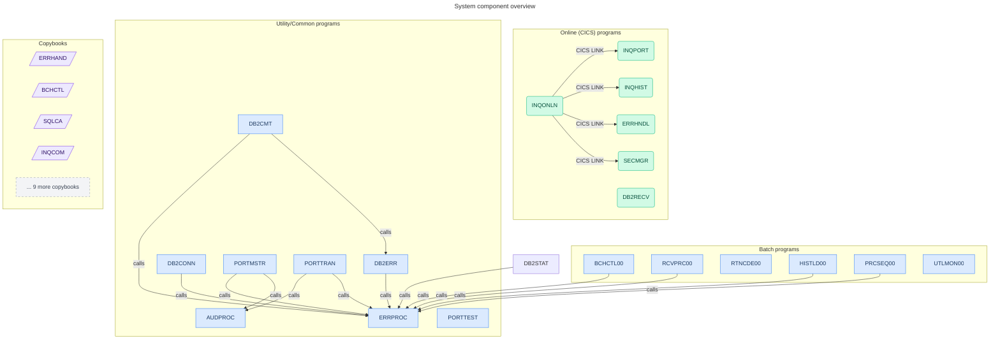
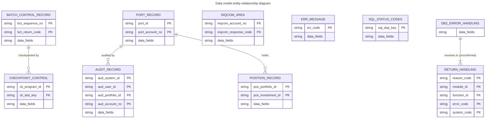
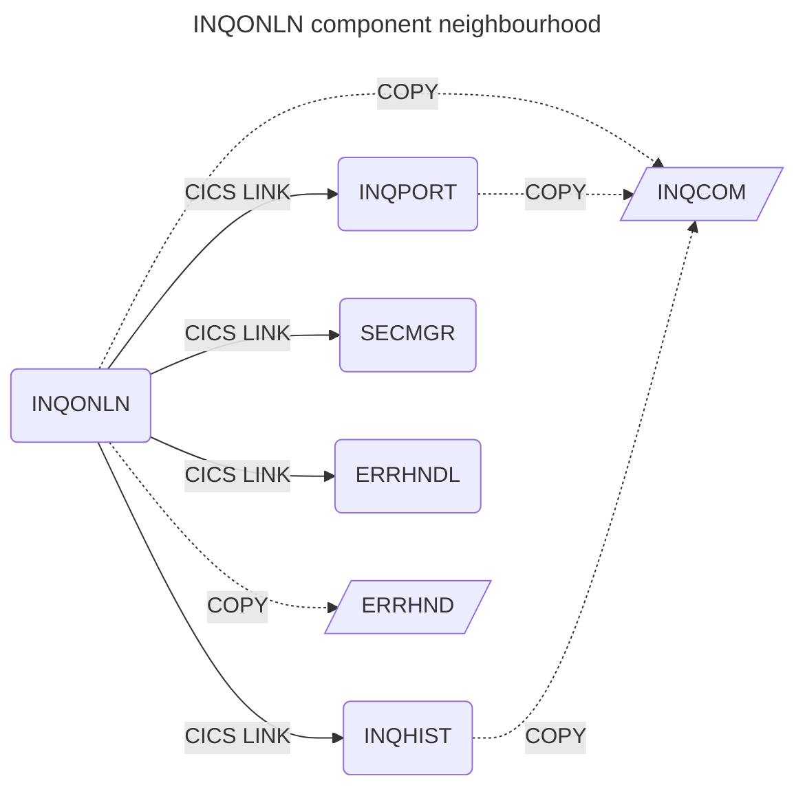
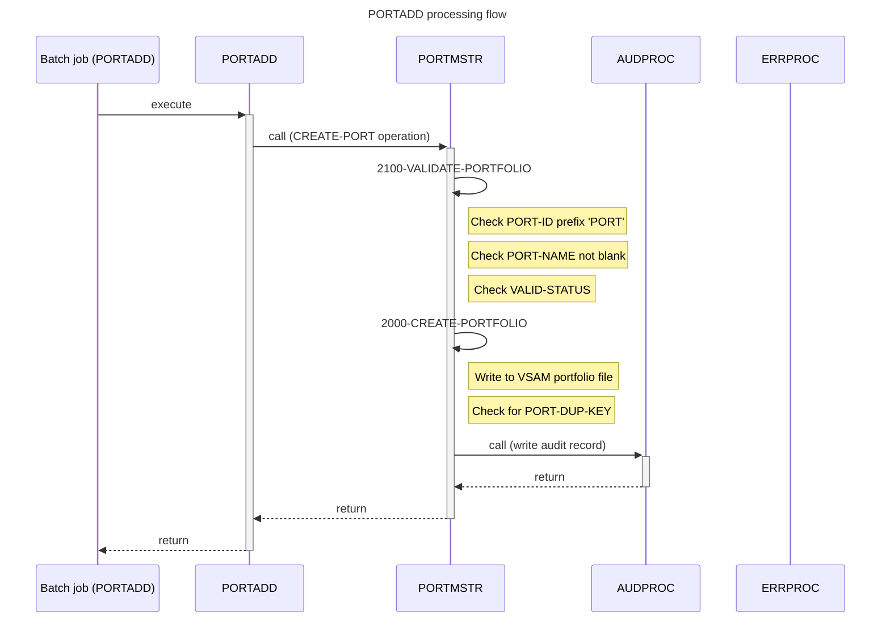
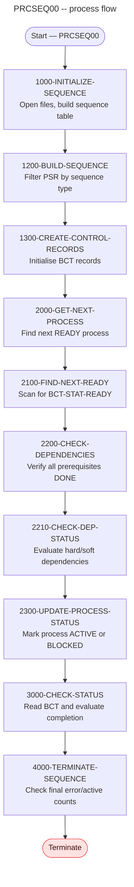
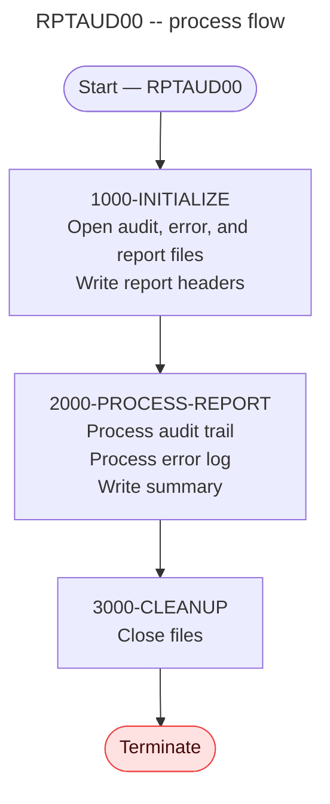
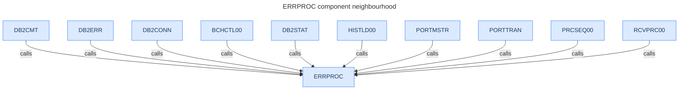
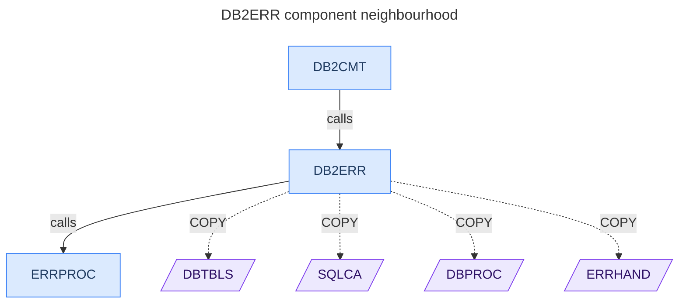

# Business Requirements Document
## Portfolio Management System

**Document type:** Reverse-engineered Business Requirements Document  
**Generated by:** COBOL Reverse Engineering Pipeline  
**Generation date:** 2026-05-03  
**Pipeline version:** agents 1–7 @1.0  
**Repository analysed:** legacy-modernization-harness  

---

> **Important:** This document was generated by automated static analysis of COBOL source code.
> All content is derived from the source files as they exist at the time of analysis.
> Business rule confidence levels are indicated throughout. Items marked ⚠ require subject
> matter expert review before the document can be considered authoritative.
>
> **Gaps identified:** 14 (0 critical, 2 high, 5 medium, 7 low)  
> See Chapter 9 — Gaps and assumptions register.

---

## Table of contents

1. [Executive summary](#1-executive-summary)
2. [System overview](#2-system-overview)
3. [System inventory](#3-system-inventory)
4. [Data model and definitions](#4-data-model-and-definitions)
5. [Business rules catalogue](#5-business-rules-catalogue)
6. [Process descriptions](#6-process-descriptions)
7. [Component architecture](#7-component-architecture)
8. [Error handling and recovery](#8-error-handling-and-recovery)
9. [Gaps and assumptions register](#9-gaps-and-assumptions-register)
- [Appendix A — Full data dictionary](#appendix-a--full-data-dictionary)
- [Appendix B — Program pseudocode reference](#appendix-b--program-pseudocode-reference)
- [Appendix C — Diagram index](#appendix-c--diagram-index)

---

## 1. Executive summary

### System purpose

The Portfolio Management System is a COBOL-based financial application deployed on IBM z/OS that manages investment portfolios for account holders. The system maintains portfolio master records, processes investment transactions (purchases, sales, and transfers of securities), provides online real-time inquiry capabilities for portfolio positions and transaction history, and generates regulatory and management reports. It integrates with IBM DB2 for historical data storage and statistics, and uses VSAM (Virtual Storage Access Method, a high-performance IBM file system) for current portfolio records and batch process control data.

### Scale and complexity

The system comprises 38 COBOL programs totalling approximately 90,000 bytes of source code across 4,200+ lines of logic paragraphs. The codebase includes 11 batch programs for overnight processing, 8 online programs handling real-time user requests via CICS (the IBM Customer Information Control System, an online transaction processing platform), 6 shared utility programs, 7 portfolio-specific sub-programs, 2 test programs, and 3 utility programs. The pipeline extracted 90 business rules from the source code, organized across categories of validation (43 rules), error handling (42 rules), and limit checking (5 rules). The data model contains 20 principal data structures with 24 key shared records. The system uses 13 shared copybooks (reusable data definition files), accesses at least 6 VSAM datasets, and interacts with DB2 via a set of dedicated database management programs.

### Key findings

The most critical business functionality centres on three areas: portfolio lifecycle management (create, read, update, and delete operations via PORTMSTR), investment transaction processing (BUY, SELL, and TRANSFER operations via PORTTRAN), and online portfolio inquiry (positions via INQPORT, history via INQHIST, orchestrated by INQONLN). ERRPROC is the system's central error handling hub, called by 8 different programs. The most complex program is BCHCTL00 (batch controller, complexity score 9), followed by INQONLN (online inquiry orchestrator, complexity score 10 for its main dispatch paragraph) and PRCSEQ00 (process sequencer, 19 paragraphs). The most significant architectural finding is that PRCSEQ00 implements a sophisticated dependency-aware batch process sequencer that controls execution order of multiple batch jobs — a critical piece of operational infrastructure. The ERRHAND copybook is the most widely shared error-handling data definition, used by 6 programs including batch and DB2 programs.

### Gaps and limitations

This analysis identified 14 gaps, of which 2 are high severity. The two high-severity gaps are unresolved external program calls: UTLMON00 calls ILBOABN0 (a standard IBM abnormal-termination routine) and DB2CONN calls DELAY (a system timing service). Both are well-known IBM utilities but are not documented by the pipeline. The most operationally significant finding requiring immediate SME attention is GAP-007: the paragraph 2200-UPDATE-POSITIONS in PORTTRAN is confirmed unreachable dead code. Combined with the empty POSUPDT program (GAP-004), there is a risk that investment position quantities are not being updated correctly by the transaction processor. Chapter 9 contains the full gaps and assumptions register, and SME review is strongly recommended before this document is used as the basis for modernisation or test planning.

---

## 2. System overview

### 2.1 System context

The Portfolio Management System operates as a mixed batch and online application on IBM z/OS. The online component uses IBM CICS (Customer Information Control System) to handle real-time user requests — portfolio inquiries, transaction history, and position summaries are displayed to users through screen-based interactions driven by a BMS (Basic Mapping Support) screen definition (`INQSET`). The batch component processes data during off-peak hours using JCL (Job Control Language) jobs; these jobs load historical data, generate reports, manage process sequencing, and perform recovery operations.

The system stores data in two persistence layers. Current portfolio records, batch control data, and checkpoint information are stored in VSAM files (sequential and keyed-access datasets). Historical position records, audit logs, statistical tracking data, and security authorisation data are stored in IBM DB2 (a relational database system). A dedicated set of database management programs (DB2CMT, DB2CONN, DB2ERR, DB2ONLN, DB2RECV, DB2STAT) provides a service layer for all DB2 interactions, handling connection management, commit and rollback control, error diagnosis, and cursor management.

External dependencies include two unresolved program calls: ILBOABN0 (IBM Language Environment abnormal termination routine, called by UTLMON00 for irrecoverable monitoring errors) and DELAY (a timing service called by DB2CONN during connection retry attempts). Both are believed to be IBM system services not present in the application repository (see GAP-001, GAP-002).

### 2.2 Program inventory summary

| Program | Type | Paragraphs | Lines | Complexity | Description | Rules |
|---|---|---|---|---|---|---|
| BCHCTL00 | Batch | 6 | 127 | Medium | Batch process controller — initialises, checks prerequisites, updates status, and terminates batch processes. | 2 |
| CKPRST | Batch | 5 | 57 | Low | Checkpoint and restart manager — saves and restores processing state for recoverable batch runs. | 1 |
| HISTLD00 | Batch | 16 | 233 | Medium | Historical data loader — reads batch transaction file and loads records into DB2 historical tables. | 5 |
| POSUPDT | Batch | 0 | 1 | — | Position update — **source file is empty** (see GAP-004). | 0 |
| PRCSEQ00 | Batch | 19 | 345 | High | Process sequencer — builds execution order, checks dependencies between batch jobs, and tracks completion status. | 15 |
| RCVPRC00 | Batch | 18 | 302 | High | Recovery processor — validates recovery requests, executes recovery steps, and updates process status after failure. | 9 |
| RPTAUD00 | Batch | 11 | 147 | Medium | Audit report generator — reads audit trail and error log files, formats and writes an audit summary report. | 3 |
| RPTPOS00 | Batch | 13 | 160 | Medium | Position report generator — reads portfolio and position data, formats and writes a position summary report. | 3 |
| RPTSTA00 | Batch | 15 | 185 | Medium | Status report generator — reads batch control records and writes a process status summary report. | 3 |
| RTNANA00 | Batch | 14 | 210 | Medium | Return code analyser — analyses return codes from batch processes and updates cumulative tracking. | 2 |
| RTNCDE00 | Batch | 12 | 141 | Medium | Return code processor — maps return codes to standard codes using a lookup structure and DB2. | 3 |
| AUDPROC | Common | 4 | 96 | Low | Audit processor — writes audit records for significant business events. Called by PORTMSTR and PORTTRAN. | 1 |
| DB2CMT | Common | 10 | 170 | Medium | DB2 commit manager — issues COMMIT, ROLLBACK, SAVEPOINT, and RESTORE operations to DB2. | 3 |
| DB2CONN | Common | 6 | 154 | Medium | DB2 connection manager — establishes and releases DB2 connections with configurable retry logic. | 5 |
| DB2ERR | Common | 7 | 200 | Medium | DB2 error handler — diagnoses DB2 errors from SQLCODE, inserts error records, and retrieves error details. | 4 |
| DB2STAT | Common | 9 | — | Medium | DB2 statistics tracker — creates a statistics table, updates metrics after processing, and displays statistics. | 3 |
| ERRPROC | Common | 6 | — | Low | Central error processor — logs errors to an error log file. Called by 8 programs as the system's error hub. | 1 |
| CURSMGR | Online | 4 | — | Low | DB2 cursor manager — declares, opens, and fetches rows from a DB2 cursor for online inquiry programs. | 2 |
| DB2ONLN | Online | 11 | — | Medium | Online DB2 connection manager — establishes and releases DB2 connections within a CICS session. | 2 |
| DB2RECV | Online | 14 | — | Medium | Online DB2 recovery manager — recovers failed DB2 connections within a CICS session with retry logic. | 5 |
| ERRHNDL | Online | 9 | — | Medium | CICS error handler — captures CICS abend conditions, generates trace identifiers, and determines recovery action. | 3 |
| INQHIST | Online | 18 | — | High | History inquiry — retrieves and displays transaction history for a portfolio using DB2 cursor-based queries. | 3 |
| INQONLN | Online | 21 | — | High | Online inquiry orchestrator — the CICS entry point. Routes user requests to portfolio inquiry, history inquiry, security check, or error handling based on screen function code. | 3 |
| INQPORT | Online | 13 | — | Medium | Portfolio position inquiry — retrieves current position records from VSAM and displays portfolio holdings. | 1 |
| SECMGR | Online | 10 | — | Medium | Security manager — validates the user ID via CICS ASSIGN and checks access authorisation against a DB2 security table. | 5 |
| PORTADD | Portfolio | 5 | — | Low | Portfolio add — validates and adds a new portfolio record to the VSAM portfolio file. | 3 |
| PORTDEL | Portfolio | 7 | — | Low | Portfolio delete — validates, deletes a portfolio record, and writes an audit trail entry. | 3 |
| PORTMSTR | Portfolio | 11 | — | Medium | Portfolio master controller — routes CREATE, READ, UPDATE, and DELETE operations to the appropriate portfolio sub-program. | 9 |
| PORTREAD | Portfolio | 5 | — | Low | Portfolio reader — reads a portfolio record from VSAM by portfolio ID. | 1 |
| PORTTEST | Portfolio | 8 | — | Low | Portfolio tester — generates and validates test portfolio records, used for system testing. | 1 |
| PORTTRAN | Portfolio | 16 | — | High | Portfolio transaction processor — validates BUY, SELL, and TRANSFER transactions; updates positions and writes audit records. | 10 |
| PORTUPDT | Portfolio | — | — | Low | Portfolio updater — applies field-level updates to an existing portfolio record. | 2 |
| PORTVALD | Portfolio | — | — | Low | Portfolio validator — validates portfolio data against standard validation rules and returns error codes. | 5 |
| TSTGEN00 | Test | 8 | 210 | Medium | Test data generator — generates synthetic portfolio and transaction test data in VSAM files. | 6 |
| TSTVAL00 | Test | — | — | Medium | Test validator — executes validation tests and reports pass/fail results. | 5 |
| UTLMNT00 | Utility | — | — | Medium | Utility maintenance — performs file maintenance operations (reorg, purge, archive). | 5 |
| UTLMON00 | Utility | — | — | Medium | Utility monitor — monitors batch processing health and triggers abnormal termination on irrecoverable errors. | 5 |
| UTLVAL00 | Utility | — | — | Medium | Utility validator — performs data integrity validations across VSAM and DB2 datasets. | 5 |

*Complexity: Low = avg score 1–3; Medium = 4–6; High = 7+. Scores derived from conditional branch count per paragraph (Logic Agent).*

### 2.3 System component diagram

**Figure 2.1 — System component overview**



*This diagram shows the most highly connected programs in the system. Blue rectangles represent batch programs; green rounded boxes represent CICS online programs. Solid arrows indicate direct program calls; "CICS LINK" arrows represent transaction links within a CICS session. ERRPROC (central error processor) is the most-called program in the system, receiving calls from 8 different programs.*

### 2.4 JCL batch jobs

The following batch jobs are defined in the repository and can be submitted to the z/OS job scheduler:

| Job name | JCL file | Step | Program | Purpose |
|---|---|---|---|---|
| RPTAUD00 | src/jcl/batch/RPTAUD.jcl | STEP01 | RPTAUD00 | Generate audit trail report |
| RPTPOS00 | src/jcl/batch/RPTPOS.jcl | STEP01 | RPTPOS00 | Generate portfolio position report |
| RPTSTA00 | src/jcl/batch/RPTSTA.jcl | STEP01 | RPTSTA00 | Generate batch status report |
| RTNANA00 | src/jcl/RTNANA.jcl | STEP01 | RTNANA00 | Analyse return codes from prior batch runs |
| PORTADD | src/jcl/portfolio/PORTADD.jcl | STEP1 | PORTADD | Add portfolio records (batch) |
| PORTDEF | src/jcl/portfolio/PORTDEF.jcl | DEFVSAM | IDCAMS | Define VSAM datasets for portfolios |
| PORTDEL | src/jcl/portfolio/PORTDEL.jcl | STEP1 | PORTDEL | Delete portfolio records (batch) |
| PORTREAD | src/jcl/portfolio/PORTREAD.jcl | STEP1 | PORTREAD | Read and list portfolio records |
| PORTTEST | src/jcl/portfolio/PORTTEST.jcl | STEP1 | PORTTEST | Generate and validate test portfolios |
| PORTUPDT | src/jcl/portfolio/PORTUPDT.jcl | STEP1 | PORTUPDT | Update portfolio records (batch) |
| TSTGEN00 | src/jcl/test/TSTGEN.jcl | STEP01 | TSTGEN00 | Generate test data |
| TSTVAL00 | src/jcl/test/TSTVAL.jcl | STEP01 | TSTVAL00 | Execute validation tests |
| UTLMNT00 | src/jcl/utility/UTLMNT.jcl | STEP01 | UTLMNT00 | Perform file maintenance |
| UTLMON00 | src/jcl/utility/UTLMON.jcl | STEP01 | UTLMON00 | Monitor batch processing health |
| UTLVAL00 | src/jcl/utility/UTLVAL.jcl | STEP01 | UTLVAL00 | Validate data integrity |

---

## 3. System inventory

### 3.1 Programs

The full list of 38 programs is given in Section 2.2. Programs are distributed across five categories:

| Category | Count | Programs |
|---|---|---|
| Batch | 11 | BCHCTL00, CKPRST, HISTLD00, POSUPDT\*, PRCSEQ00, RCVPRC00, RPTAUD00, RPTPOS00, RPTSTA00, RTNANA00, RTNCDE00 |
| Online (CICS) | 8 | CURSMGR, DB2ONLN, DB2RECV, ERRHNDL, INQHIST, INQONLN, INQPORT, SECMGR |
| Common/utility sub-programs | 6 | AUDPROC, DB2CMT, DB2CONN, DB2ERR, DB2STAT, ERRPROC |
| Portfolio sub-programs | 8 | PORTADD, PORTDEL, PORTMSTR, PORTREAD, PORTTEST, PORTTRAN, PORTUPDT, PORTVALD |
| Test and utility | 5 | TSTGEN00, TSTVAL00, UTLMNT00, UTLMON00, UTLVAL00 |

*\* POSUPDT source file is empty — see GAP-004.*

All 38 programs were parsed successfully (0 parse failures). 112 dead code candidate paragraphs were identified across the codebase; none are confirmed to contain active business logic (the most significant confirmed dead code items are covered in the gaps register).

### 3.2 Copybooks

Copybooks (reusable COBOL data definition files) are the primary mechanism for sharing data structures between programs.

| Copybook | Path | Type | Used by | Notes |
|---|---|---|---|---|
| ERRHAND | src/copybook/common/ERRHAND.cpy | Error handling constants | BCHCTL00, CKPRST, DB2CMT, DB2CONN, DB2ERR, PORTTEST | **Shared infrastructure** — 6 programs |
| SQLCA | src/copybook/db2/SQLCA.cpy | DB2 SQL Communication Area | DB2CMT, DB2CONN, DB2ERR, CURSMGR, INQHIST | **Shared infrastructure** — 5 programs |
| BCHCTL | src/copybook/batch/BCHCTL.cpy | Batch control record | BCHCTL00, CKPRST, HISTLD00, PRCSEQ00, RCVPRC00 | **Shared infrastructure** — 5 programs |
| INQCOM | src/copybook/online/INQCOM.cpy | Online inquiry common area | INQHIST, INQONLN, INQPORT | Shared by all 3 inquiry programs |
| DBPROC | src/copybook/db2/DBPROC.cpy | DB2 processing area | DB2CMT, DB2CONN, DB2ERR | Shared by all DB2 common programs |
| AUDITLOG | src/copybook/common/AUDITLOG.cpy | Audit record layout | AUDPROC | Single-use |
| BCHCON | src/copybook/batch/BCHCON.cpy | Batch control constants | BCHCTL00 | Single-use |
| CKPRST | src/copybook/batch/CKPRST.cpy | Checkpoint control | CKPRST | Single-use |
| PORTFLIO | src/copybook/common/PORTFLIO.cpy | Portfolio record layout | PORTTEST | Single-use (test only) |
| PORTVAL | src/copybook/common/PORTVAL.cpy | Portfolio validation constants | PORTVALD | Single-use |
| POSREC | src/copybook/common/POSREC.cpy | Position record layout | INQPORT | Single-use |
| RETHND | src/copybook/common/RETHND.cpy | Return handling | CKPRST | Single-use |
| RTNCODE | src/copybook/common/RTNCODE.cpy | Return code area | RTNCDE00 | Single-use |
| COMMON | src/copybook/common/COMMON.cpy | Common constants | *None* | **Not used by any program** — see GAP-013 |
| DBTBLS | src/copybook/db2/DBTBLS.cpy | DB2 table definitions | DB2ERR | Single-use |
| DB2REQ | src/copybook/online/DB2REQ.cpy | DB2 request area | DB2RECV | Single-use |
| ERRHND | src/copybook/online/ERRHND.cpy | Online error handling | DB2ONLN, DB2RECV, ERRHNDL, INQONLN, SECMGR | Online-specific; similar name to ERRHAND — see GAP-010 |
| PRCSEQ | src/copybook/batch/PRCSEQ.cpy | Process sequence | *None* | Not used by any program |
| HISTREC | src/copybook/common/HISTREC.cpy | History record | *None* | Not used by any program |
| TRNREC | src/copybook/common/TRNREC.cpy | Transaction record | *None* | Not used by any program |

### 3.3 Files and datasets

The following files and datasets are accessed by the system, derived from file status field names and JCL definitions:

| File/Dataset | Access type | Key programs | Description |
|---|---|---|---|
| Portfolio VSAM file | Read/Write | PORTADD, PORTDEL, PORTMSTR, PORTREAD, PORTUPDT | Portfolio master records keyed on portfolio ID |
| Position VSAM file | Read | INQPORT | Current investment position records |
| Batch control file (BCT) | Read/Write | BCHCTL00, HISTLD00, PRCSEQ00, RCVPRC00 | Process execution status, return codes, sequence data |
| Transaction history file (TH) | Read | HISTLD00 | Source records for historical data loading |
| Process sequence record file (PSR) | Read | PRCSEQ00 | Process dependency definitions and sequencing rules |
| Checkpoint file | Read/Write | CKPRST | Checkpoint/restart control records |
| Audit log file | Read/Write | AUDPROC, RPTAUD00 | Business event audit trail |
| Error log file | Read/Write | ERRPROC, RPTAUD00 | Error records for reporting |
| Report output file | Write | RPTAUD00, RPTPOS00, RPTSTA00 | Formatted report output |
| DB2 AUTHFILE table | Read | SECMGR | User authorisation records (security) |
| DB2 statistics table | Read/Write | DB2STAT | Processing statistics |
| DB2 error table | Read/Write | DB2ERR | DB2 error records |
| DB2 history tables | Write | HISTLD00 | Historical position records |

### 3.4 CICS transactions

One BMS screen map is defined in the repository: `INQSET` (src/maps/INQSET.bms). This map drives the online inquiry screen used by INQONLN to display portfolio inquiry results. The CICS CSD (CICS System Definition) file `src/cics/PORTDFN.csd` defines the CICS resource definitions but was not fully parsed by the pipeline.

Based on the INQONLN program logic, the online inquiry supports at least three screen functions:
- **Menu display** — initial screen for selecting inquiry type
- **Portfolio inquiry** (function code INQP) — routes to INQPORT for position data
- **History inquiry** (function code INQH) — routes to INQHIST for transaction history

---

## 4. Data model and definitions

### 4.1 Entity-relationship diagram

**Figure 4.1 — Entity relationship diagram (key shared data structures)**



*This diagram shows the 10 most significant data structures and their relationships. Relationships marked "unconfirmed" are based on structural analysis (shared field names) and require data architect review. The full ERD with all 20 entities is in Appendix A.*

### 4.2 Entity descriptions

#### Portfolio record (`PORT-RECORD`)

**Source copybook:** PORTFLIO  
**Used by programs:** PORTMSTR, PORTADD, PORTDEL, PORTREAD, PORTUPDT, PORTTEST  
**Key fields:** `PORT-ID` (primary key), `PORT-ACCOUNT-NO` (linked account)

The portfolio record is the core data structure for investment portfolio information. A portfolio is identified by a `PORT-ID` that must begin with the four characters 'PORT' (enforced by business rule RULE-VALIDATE-PORT-IS-PORT). Each portfolio is associated with an account number (`PORT-ACCOUNT-NO`) and has a name (`PORT-NAME`), which must not be blank when creating a portfolio. The portfolio has a status field controlled by `VALID-STATUS` conditions.

**PORTMSTR operations:** CREATE, READ, UPDATE, DELETE

---

#### Position record (`POSITION-RECORD`)

**Source copybook:** POSREC  
**Used by programs:** INQPORT  
**Key fields:** `POS-PORTFOLIO-ID` (links to portfolio), `POS-INVESTMENT-ID`

The position record represents a holding of a particular investment within a portfolio. It is keyed by a composite of portfolio ID and investment ID, allowing multiple positions per portfolio. Position data is read by the online inquiry program INQPORT to display current holdings. Note: the batch program POSUPDT, which was presumably responsible for updating position quantities after transactions, has an empty source file (see GAP-004).

---

#### Audit record (`AUDIT-RECORD`)

**Source copybook:** AUDITLOG  
**Used by programs:** AUDPROC  
**Key fields:** `AUD-SYSTEM-ID`, `AUD-USER-ID`, `AUD-PORTFOLIO-ID`, `AUD-ACCOUNT-NO`

The audit record captures business events for regulatory and operational audit purposes. It is written by AUDPROC, which is called by PORTMSTR and PORTTRAN after significant portfolio and transaction operations. The record links the event to the initiating system, user, portfolio, and account, providing full traceability for each business action.

---

#### Batch control record (`BATCH-CONTROL-RECORD`)

**Source copybook:** BCHCTL  
**Used by programs:** BCHCTL00, CKPRST, HISTLD00, PRCSEQ00, RCVPRC00

The batch control record is the shared data structure for managing batch process execution. It carries the job name (`BCT-JOB-NAME`), sequence number, return code, and execution status. Status values include READY, ACTIVE, ERROR, and DONE (represented by condition names BCT-STAT-READY, BCT-STAT-ACTIVE, BCT-STAT-ERROR, BCT-STAT-DONE). This record is the primary communication channel between PRCSEQ00 (the process sequencer) and individual batch programs.

---

#### Inquiry common area (`INQCOM-AREA`)

**Source copybook:** INQCOM  
**Used by programs:** INQHIST, INQONLN, INQPORT  
**Key fields:** `INQCOM-ACCOUNT-NO`, `INQCOM-RESPONSE-CODE`

The inquiry common area is a shared communication structure passed between the online inquiry orchestrator (INQONLN) and the portfolio inquiry (INQPORT) and history inquiry (INQHIST) programs via CICS LINK. It carries the account number for the inquiry and the response code indicating success or failure.

---

#### Error message structure (`ERR-MESSAGE`)

**Source copybook:** ERRHAND  
**Used by programs:** BCHCTL00, CKPRST, DB2CMT, DB2CONN, DB2ERR, PORTTEST  
**Key fields:** `ERR-CODE`

The error message structure provides a shared set of error codes and messages used across batch and DB2 programs. It is part of the ERRHAND copybook, which also defines error categories (ERR-CATEGORIES), return codes (ERR-RETURN-CODES), and VSAM error status mappings (ERR-VSAM-STATUSES, ERR-VSAM-MSGS). The ERRHAND copybook is the most widely used data definition file in the batch tier.

---

#### Return handling record (`RETURN-HANDLING`)

**Source copybook:** RETHND  
**Used by programs:** CKPRST  
**Key fields:** `REASON-CODE`, `MODULE-ID`, `FUNCTION-ID`, `ERROR-CODE`, `SYSTEM-CODE`

The return handling record maps return codes from external calls to internal reason codes. It provides a structured response to callers after CKPRST (checkpoint/restart) processes a recovery request, identifying the specific module, function, and error code associated with the return.

---

#### DB2 error handling area (`DB2-ERROR-HANDLING`)

**Source copybook:** DBPROC  
**Used by programs:** DB2CMT, DB2CONN, DB2ERR

The DB2 error handling area is a shared workspace for the three core DB2 management programs. It holds DB2 connection state, request information, and diagnostic data. This structure enables the DB2 service layer (DB2CMT, DB2CONN, DB2ERR) to communicate consistently about database operation outcomes.

---

#### SQL status codes (`SQL-STATUS-CODES`)

**Source copybook:** SQLCA  
**Used by programs:** DB2CMT, DB2CONN, DB2ERR, CURSMGR, INQHIST  
**Key fields:** `SQL-DUP-KEY`

The SQL Communication Area (SQLCA, a standard IBM DB2 structure) is used by all programs that execute SQL statements. It contains `SQLCODE` — the primary DB2 response indicator — where 0 means success, 100 means no rows found, and negative values indicate errors. The condition name `SQL-DUP-KEY` is used to detect duplicate key violations (SQLCODE -803), which HISTLD00 handles explicitly when loading historical records.

---

### 4.3 Relationship: Error handling → Return handling

**Relationship REL-001 — Confidence: medium ⚠**

The data model detected a potential relationship between `ENT-ERROR-HANDLING` and `ENT-RETURN-HANDLING` via a shared `ERROR-CODE` field. This relationship has medium confidence and requires data architect confirmation before it is used in integration or modernisation planning. See GAP-005.

---

## 5. Business rules catalogue

### 5.1 Overview

The pipeline extracted 90 business rules from 37 programs. Rules are categorised as follows:

| Category | Count | Description |
|---|---|---|
| VALIDATION | 43 | Rules that check field values, required values, or conditions before proceeding |
| ERROR_HANDLING | 42 | Rules that detect and respond to error conditions (file status, SQLCODE, CICS response) |
| LIMIT_CHECK | 5 | Rules that enforce numeric or count boundaries |

Of the 90 rules, 11 are high confidence and 79 are medium confidence. Medium-confidence rules are drawn directly from code conditions and are likely technically accurate but may not capture the full business intent without expert confirmation (see GAP-012).

**Rules by program (programs with 5 or more rules):**

| Program | Rules | Focus |
|---|---|---|
| PRCSEQ00 | 15 | Process sequencing, dependency checks, status management |
| PORTTRAN | 10 | Transaction validation, type routing, amount/price checking |
| PORTMSTR | 9 | Portfolio CRUD operations, validation, status management |
| RCVPRC00 | 9 | Recovery validation, request processing, file status |
| SECMGR | 5 | User identity validation, DB2 access authorisation |
| DB2CONN | 5 | Connection state management, retry limits |
| PORTVALD | 5 | Portfolio validation constants and error codes |
| TSTGEN00 | 6 | Test data generation controls |
| TSTVAL00 | 5 | Test execution and validation |
| UTLMNT00 | 5 | Maintenance function processing |
| UTLMON00 | 5 | Monitoring and health check |
| UTLVAL00 | 5 | Data integrity validation |

---

### 5.2 Portfolio management rules

These rules govern the creation, validation, and management of portfolio records.

---

#### RULE-VALIDATE-PORT-IS-PORT — Portfolio ID must begin with 'PORT'

**Category:** Validation | **Confidence:** Medium ⚠  
**Program:** PORTMSTR (paragraph 2100-VALIDATE-PORTFOLIO)

The portfolio identifier (`PORT-ID`) must begin with the four-character prefix 'PORT'. This is enforced by checking that the first four bytes of the portfolio ID are not equal to 'PORT' — if they are not, validation fails and the portfolio operation is rejected.

**Condition:** `PORT-ID(1:4) NOT = 'PORT'`  
**Outcome if true:** Validation fails — portfolio operation rejected  
**Source:** PORTMSTR, paragraph 2100-VALIDATE-PORTFOLIO

---

#### RULE-VALIDATE-PORT-NAME-IS-NOT-BLANK — Portfolio name must not be blank

**Category:** Validation | **Confidence:** Medium ⚠  
**Program:** PORTMSTR (paragraph 2100-VALIDATE-PORTFOLIO)

A portfolio record must have a non-blank portfolio name (`PORT-NAME`). If the name field contains only spaces, portfolio creation is rejected.

**Condition:** `PORT-NAME = SPACES`  
**Outcome if true:** Validation fails — portfolio creation rejected  
**Source:** PORTMSTR, paragraph 2100-VALIDATE-PORTFOLIO

---

#### RULE-VALIDATE-PORT-SUCCESS — Portfolio operation must succeed

**Category:** Validation | **Confidence:** Medium ⚠  
**Program:** PORTMSTR (paragraphs 1000-INITIALIZE, 2000-CREATE-PORTFOLIO, 4000-UPDATE-PORTFOLIO, 5000-DELETE-PORTFOLIO)

After each portfolio file operation (create, update, delete), the program checks whether the operation succeeded using the `PORT-SUCCESS` condition. If not successful, error handling is invoked.

**Condition:** `NOT PORT-SUCCESS`  
**Outcome if true:** Route to error handler  
**Source:** PORTMSTR, paragraphs 1000-INITIALIZE through 5000-DELETE-PORTFOLIO

---

#### RULE-VALIDATE-PORT-DUP-KEY — Reject duplicate portfolio IDs

**Category:** Validation | **Confidence:** Medium ⚠  
**Program:** PORTMSTR (paragraph 2000-CREATE-PORTFOLIO)

When creating a new portfolio, the program checks for a duplicate key condition (`PORT-DUP-KEY`). If a portfolio with the same ID already exists, the create operation is rejected with a duplicate key error.

**Condition:** `PORT-DUP-KEY`  
**Outcome if true:** Return duplicate key error to caller  
**Source:** PORTMSTR, paragraph 2000-CREATE-PORTFOLIO

---

#### RULE-VALIDATE-PORT-ID-IS-NOT-EMPTY — Portfolio ID must be provided for add

**Category:** Validation | **Confidence:** Medium ⚠  
**Program:** PORTADD (paragraph 2100-VALIDATE-AND-ADD)

When adding a portfolio, the portfolio ID must be provided and must not be blank.

**Condition:** `PORT-ID EQUAL SPACES`  
**Outcome if true:** Validation fails — add rejected  
**Source:** PORTADD, paragraph 2100-VALIDATE-AND-ADD

---

#### RULE-VALIDATE-WS-AUD-SUCCESS — Audit write must succeed after portfolio delete

**Category:** Validation | **Confidence:** Medium ⚠  
**Program:** PORTDEL (paragraph 2300-WRITE-AUDIT)

After deleting a portfolio, an audit record is written. If the audit write fails (`NOT WS-AUD-SUCCESS`), the error is captured and reported.

**Condition:** `NOT WS-AUD-SUCCESS`  
**Outcome if true:** Audit write failure — error reported  
**Source:** PORTDEL, paragraph 2300-WRITE-AUDIT

---

### 5.3 Transaction processing rules

These rules govern investment transaction processing in PORTTRAN. Transactions are classified as BUY, SELL, or TRANSFER (type code 'TR').

---

#### RULE-VALIDATE-TRN-PRICE-MEETS-CRITERIA — Transaction price must be positive (not TRANSFER) ✓

**Category:** Validation | **Confidence:** High ✓  
**Program:** PORTTRAN (paragraph 2130-CHECK-AMOUNTS)

For BUY and SELL transactions, the transaction price (`TRN-PRICE`) must be greater than zero. TRANSFER transactions (type 'TR') are exempt from this check because transfers do not involve a price per unit.

**Condition:** `TRN-PRICE <= ZERO AND TRN-TYPE NOT = 'TR'`  
**Outcome if true:** Validation fails — transaction rejected with invalid price  
**Source:** PORTTRAN, paragraph 2130-CHECK-AMOUNTS

---

#### RULE-VALIDATE-TRN-AMOUNT-MEETS-CRITERIA — Transaction amount must be positive (not TRANSFER) ✓

**Category:** Validation | **Confidence:** High ✓  
**Program:** PORTTRAN (paragraph 2130-CHECK-AMOUNTS)

For BUY and SELL transactions, the transaction amount (`TRN-AMOUNT`) must be greater than zero. TRANSFER transactions are exempt.

**Condition:** `TRN-AMOUNT <= ZERO AND TRN-TYPE NOT = 'TR'`  
**Outcome if true:** Validation fails — transaction rejected with invalid amount  
**Source:** PORTTRAN, paragraph 2130-CHECK-AMOUNTS

---

#### RULE-VALIDATE-TRN-QUANTITY — Transaction quantity must be positive

**Category:** Validation | **Confidence:** Medium ⚠  
**Program:** PORTTRAN (paragraph 2130-CHECK-AMOUNTS)

The number of units in any transaction (`TRN-QUANTITY`) must be greater than zero, regardless of transaction type.

**Condition:** `TRN-QUANTITY <= ZERO`  
**Outcome if true:** Validation fails — transaction rejected  
**Source:** PORTTRAN, paragraph 2130-CHECK-AMOUNTS

---

#### RULE-CHECK-PORTFOLIO-BEFORE-TRANSACTION — Portfolio ID must not be blank before transaction

**Category:** Validation | **Confidence:** Medium ⚠  
**Program:** PORTTRAN (paragraph 2110-CHECK-PORTFOLIO)

A transaction must reference a valid, non-blank portfolio ID (`TRN-PORTFOLIO-ID`). If the portfolio ID is blank, the transaction is rejected before any further processing.

**Condition:** `TRN-PORTFOLIO-ID = SPACES`  
**Outcome if true:** Validation fails — transaction rejected  
**Source:** PORTTRAN, paragraph 2110-CHECK-PORTFOLIO

---

#### RULE-VALIDATE-SELL-UNITS-AVAILABLE — Insufficient units for sell

**Category:** Limit Check | **Confidence:** Medium ⚠  
**Program:** PORTTRAN (paragraph 2220-PROCESS-SELL)

During a SELL transaction, the portfolio must hold at least as many units as are being sold. If the current holding (`PORT-TOTAL-UNITS`) is less than the transaction quantity (`TRN-QUANTITY`), the sell is rejected.

**Condition:** `PORT-TOTAL-UNITS < TRN-QUANTITY`  
**Outcome if true:** SELL rejected — insufficient units in portfolio  
**Source:** PORTTRAN, paragraph 2220-PROCESS-SELL

> ⚠ **SME review recommended**  
> The position-update paragraph in PORTTRAN (2200-UPDATE-POSITIONS) is confirmed dead code (GAP-007), and the POSUPDT program is empty (GAP-004). It is not confirmed that `PORT-TOTAL-UNITS` is being updated correctly after each BUY/SELL. This rule's effectiveness depends on accurate position tracking — SME review is required.

---

### 5.4 Process sequencing rules (PRCSEQ00)

PRCSEQ00 implements a sophisticated batch process sequencer that determines the execution order of batch jobs and enforces dependency rules between them.

---

#### RULE-VALIDATE-PSR-TYPE — Process must match requested sequence type ✓

**Category:** Validation | **Confidence:** High ✓  
**Program:** PRCSEQ00 (paragraph 1200-BUILD-SEQUENCE)

When building the execution sequence, each process sequence record (`PSR-TYPE`) is included in the execution plan only if its type matches the requested sequence type (`LS-SEQUENCE-TYPE`). This allows the sequencer to build execution plans for specific process categories.

**Condition:** `PSR-TYPE = LS-SEQUENCE-TYPE`  
**Outcome if true:** Include process in execution sequence  
**Source:** PRCSEQ00, paragraph 1200-BUILD-SEQUENCE

---

#### RULE-VALIDATE-WS-SUB-MEETS-CONDITION — Hard dependency must be satisfied before proceeding ✓

**Category:** Validation | **Confidence:** High ✓  
**Program:** PRCSEQ00 (paragraph 2210-CHECK-DEP-STATUS)

When checking process dependencies, if a prerequisite is marked as a hard dependency (`PSR-DEP-HARD`), its completion status and return code are validated before the dependent process is allowed to run.

**Condition:** `PSR-DEP-HARD(WS-SUB)` (array-indexed by dependency subscript)  
**Outcome if true:** Check dependency return code against maximum acceptable code  
**Source:** PRCSEQ00, paragraph 2210-CHECK-DEP-STATUS

---

#### RULE-VALIDATE-PSR-RESTARTABLE — Restartable process can be restarted after error ✓

**Category:** Validation | **Confidence:** High ✓  
**Program:** PRCSEQ00 (paragraph 2210-CHECK-DEP-STATUS)

Some processes are flagged as restartable in their sequence record (`PSR-RESTARTABLE`). This flag controls whether the sequencer can retry a process that previously ended in an error state.

**Condition:** `PSR-RESTARTABLE`  
**Outcome if true:** Process is eligible for restart after error  
**Source:** PRCSEQ00, paragraph 2210-CHECK-DEP-STATUS

---

#### RULE-HANDLE-BCT-STATUS-DONE — Prerequisite must be in DONE status ✓

**Category:** Error Handling | **Confidence:** High ✓  
**Program:** PRCSEQ00 (paragraph 2210-CHECK-DEP-STATUS)

When checking a dependency's completion status, the prerequisite batch job must be in BCT-STATUS-DONE state. If not done, the dependency check fails and the dependent process remains in READY status, waiting for the prerequisite to complete.

**Condition:** `NOT BCT-STATUS-DONE`  
**Outcome if true:** Dependency not satisfied — dependent process blocked  
**Source:** PRCSEQ00, paragraph 2210-CHECK-DEP-STATUS

---

#### RULE-HANDLE-BCT-STATUS-ERROR — Error status triggers dependency failure ✓

**Category:** Error Handling | **Confidence:** High ✓  
**Program:** PRCSEQ00 (paragraph 3300-CHECK-COMPLETION)

During status monitoring, if a batch process transitions to BCT-STAT-ERROR status, the sequencer detects this and increments the error count. Downstream processes with a hard dependency on this process will be blocked.

**Condition:** `WS-PROC-STATUS(WS-SEQUENCE-IX) = BCT-STAT-ERROR`  
**Outcome if true:** Increment error count; block dependent processes  
**Source:** PRCSEQ00, paragraph 3300-CHECK-COMPLETION

---

### 5.5 Return code management rules

#### RULE-VALIDATE-RESPONSE-NEW-CODE — New return code replaces highest when higher ✓

**Category:** Validation | **Confidence:** High ✓  
**Program:** RTNCDE00 (paragraph P200-SET-RETURN-CODE)

When processing a return code from a batch step, the new return code (`RC-NEW-CODE`) is compared to the current highest recorded code (`RC-HIGHEST-CODE`). If the new code is higher, it replaces the highest code. This implements a "worst-case return code" tracking pattern.

**Condition:** `RC-NEW-CODE > RC-HIGHEST-CODE`  
**Outcome if true:** Update RC-HIGHEST-CODE to RC-NEW-CODE  
**Source:** RTNCDE00, paragraph P200-SET-RETURN-CODE

---

#### RULE-VALIDATE-COMMIT-FREQUENCY — Commit issued when records processed reaches threshold

**Category:** Validation | **Confidence:** Medium ⚠  
**Program:** HISTLD00 (paragraph 2300-CHECK-COMMIT)

During historical data loading, a DB2 COMMIT is issued when the number of records processed (`WS-COMMIT-COUNT`) reaches the configured commit frequency threshold (`WS-COMMIT-THRESHOLD`). This prevents excessive transaction log growth during large batch loads.

**Condition:** `WS-COMMIT-COUNT >= WS-COMMIT-THRESHOLD`  
**Outcome if true:** Call DB2CMT to issue COMMIT; reset commit counter  
**Source:** HISTLD00, paragraph 2300-CHECK-COMMIT

---

### 5.6 DB2 connectivity and database rules

These rules govern the connection to and interaction with the IBM DB2 database.

---

#### RULE-ENFORCE-WS-RETRY-COUNT — Connection retry count must not exceed maximum

**Category:** Limit Check | **Confidence:** Medium ⚠  
**Program:** DB2CONN (paragraph 1000-CONNECT)

The DB2 connection manager attempts to connect to DB2 with a retry mechanism. The retry counter (`WS-RETRY-COUNT`) must remain below the maximum retry limit (`WS-MAX-RETRIES`). Once the limit is reached, the connection attempt fails permanently and an error is returned to the caller.

**Condition:** `WS-RETRY-COUNT < WS-MAX-RETRIES`  
**Outcome if true:** Retry connection; call DELAY to wait before next attempt (see GAP-002)  
**Source:** DB2CONN, paragraph 1000-CONNECT

---

#### RULE-ENFORCE-WS-RETRY-COUNT-EQUALS — Maximum retries reached indicates failure

**Category:** Limit Check | **Confidence:** Medium ⚠  
**Program:** DB2RECV (paragraph END-PERFORM)

In the online DB2 recovery manager, if the retry count meets or exceeds the maximum (`WS-RETRY-COUNT >= WS-MAX-RETRIES`), the recovery attempt is abandoned and a failure is returned.

**Condition:** `WS-RETRY-COUNT >= WS-MAX-RETRIES`  
**Outcome if true:** Recovery abandoned — return failure  
**Source:** DB2RECV, paragraph END-PERFORM

---

#### RULE-HANDLE-SQLCODE-EQUALS — DB2 SQL operations must succeed

**Category:** Error Handling | **Confidence:** Medium ⚠  
**Program:** DB2CMT, DB2CONN, DB2ERR, DB2ONLN, DB2RECV, DB2STAT, CURSMGR, INQHIST, RTNANA00, RTNCDE00, SECMGR, ERRHNDL (widespread)

After every SQL statement (COMMIT, ROLLBACK, INSERT, SELECT, etc.), the SQLCODE is checked. A value of 0 indicates success. A non-zero value triggers error handling. This pattern appears in 12 programs and is the primary DB2 error-detection mechanism throughout the system.

**Condition:** `SQLCODE NOT = 0`  
**Outcome if true:** Call DB2ERR for diagnosis or call ERRPROC to log the error  
**Source:** Multiple programs — DB2CMT, DB2CONN, DB2ERR, and 9 others

---

#### RULE-HANDLE-SQLCODE-MEETS-CRITERIA — Table creation ignores already-exists error ✓

**Category:** Error Handling | **Confidence:** High ✓  
**Program:** DB2STAT (paragraph 1100-CREATE-STATS-TABLE)

When creating the statistics table, a SQLCODE of -601 (object already exists) is intentionally ignored. Only unexpected errors (SQLCODE not equal to 0 and not equal to -601) trigger error handling. This allows the statistics program to run idempotently without failing if the table was already created by a previous run.

**Condition:** `SQLCODE NOT = 0 AND SQLCODE NOT = -601`  
**Outcome if true:** Error condition — table creation failed unexpectedly  
**Source:** DB2STAT, paragraph 1100-CREATE-STATS-TABLE

---

#### RULE-ENFORCE-MAX-CONNECTIONS — Active connections must not exceed maximum

**Category:** Limit Check | **Confidence:** Medium ⚠  
**Program:** DB2ONLN (paragraph P100-PROCESS-CONNECT)

The online DB2 connection manager enforces a maximum concurrent connections limit. New connections are only established if the current active connection count (`WS-ACTIVE-CONNECTIONS`) is below the maximum (`WS-MAX-CONNECTIONS`).

**Condition:** `WS-ACTIVE-CONNECTIONS < WS-MAX-CONNECTIONS`  
**Outcome if true:** Proceed with connection establishment  
**Source:** DB2ONLN, paragraph P100-PROCESS-CONNECT

---

### 5.7 Online security rules

---

#### RULE-HANDLE-SEC-RESPONSE-CODE — Security check must succeed before inquiry

**Category:** Error Handling | **Confidence:** Medium ⚠  
**Program:** INQONLN (paragraph END-EXEC dispatch block)

After calling SECMGR to validate the user's identity and authorisation, INQONLN checks the security response code. If the security check fails (`SEC-RESPONSE-CODE NOT = 0`), the error routine is called and the inquiry is not processed.

**Condition:** `SEC-RESPONSE-CODE NOT = 0`  
**Outcome if true:** Route to P900-ERROR-ROUTINE; deny inquiry access  
**Source:** INQONLN, dispatch paragraph

---

#### RULE-VALIDATE-USER-IDENTITY — CICS user ID must match requested user ID

**Category:** Validation | **Confidence:** Medium ⚠  
**Program:** SECMGR (paragraph following P100-VALIDATE-USER)

The security manager validates the current CICS session user ID by using EXEC CICS ASSIGN to retrieve the actual user ID, then comparing it to the user ID in the security request (`SEC-USER-ID = WS-USER-ID`). If they match, the security response code is set to 0 (success). A mismatch results in response code 8 (identity mismatch).

**Condition:** `SEC-USER-ID = WS-USER-ID`  
**Outcome if true:** Set `SEC-RESPONSE-CODE = 0` (identity confirmed)  
**Outcome if false:** Set `SEC-RESPONSE-CODE = 8` (identity mismatch — access denied)  
**Source:** SECMGR, post-P100 paragraph

---

#### RULE-VALIDATE-ERROR-ABEND — CICS abend condition triggers error routine ✓

**Category:** Validation | **Confidence:** High ✓  
**Program:** INQONLN

If a CICS abend (abnormal end) condition is detected (`ERR-ABEND`), the online inquiry program routes immediately to the error handler. This prevents the system from continuing to process a transaction in an inconsistent state.

**Condition:** `ERR-ABEND`  
**Outcome if true:** Route to error handler; do not process inquiry  
**Source:** INQONLN

---

#### RULE-VALIDATE-ERROR-CONTINUE — Error continue flag allows processing to resume ✓

**Category:** Validation | **Confidence:** High ✓  
**Program:** DB2RECV

The `ERR-CONTINUE` condition flag signals that an error condition is recoverable and processing may continue after the error is handled. This is used in the DB2 recovery manager to distinguish between recoverable and fatal errors.

**Condition:** `ERR-CONTINUE`  
**Outcome if true:** Processing continues after error notification  
**Source:** DB2RECV

---

### 5.8 File I/O and status rules

File status checking rules are widely distributed across the system. After every file open, read, write, or close operation, a two-character status field is checked for successful completion (value '00').

| Rule ID | Program(s) | Field checked | Description |
|---|---|---|---|
| RULE-HANDLE-WS-FILE-STATUS-IS-00 | AUDPROC, PORTTEST | WS-FILE-STATUS | Audit and portfolio test file status check |
| RULE-HANDLE-WS-LOG-STATUS-IS-00 | ERRPROC, UTLMON00 | WS-LOG-STATUS | Error log file status check |
| RULE-HANDLE-WS-TH-STATUS-IS-00 | HISTLD00 | WS-TH-STATUS | Transaction history file open status |
| RULE-HANDLE-WS-BCT-STATUS-IS-00 | HISTLD00, PRCSEQ00, RCVPRC00 | WS-BCT-STATUS | Batch control file status |
| RULE-HANDLE-WS-AUDIT-STATUS | RPTAUD00 | WS-AUDIT-STATUS | Audit file status at report open |
| RULE-HANDLE-WS-ERROR-STATUS | RPTAUD00 | WS-ERROR-STATUS | Error log file status at report open |
| RULE-HANDLE-WS-REPORT-STATUS | RPTAUD00 | WS-REPORT-STATUS | Report output file status |

---

### 5.9 Rules cross-reference by program

| Program | Rule count | Key rule IDs |
|---|---|---|
| PRCSEQ00 | 15 | RULE-VALIDATE-PSR-TYPE, RULE-VALIDATE-WS-SUB, RULE-VALIDATE-PSR-RESTARTABLE, RULE-HANDLE-BCT-STATUS-DONE, RULE-HANDLE-BCT-STATUS-ERROR |
| PORTTRAN | 10 | RULE-VALIDATE-TRN-PRICE, RULE-VALIDATE-TRN-AMOUNT, RULE-VALIDATE-TRN-QUANTITY, RULE-CHECK-PORTFOLIO, RULE-VALIDATE-SELL-UNITS |
| PORTMSTR | 9 | RULE-VALIDATE-PORT-IS-PORT, RULE-VALIDATE-PORT-NAME, RULE-VALIDATE-PORT-SUCCESS, RULE-VALIDATE-PORT-DUP-KEY |
| RCVPRC00 | 9 | RULE-HANDLE-WS-BCT-STATUS, RULE-VALIDATE-BCT-STATUS, RULE-HANDLE-RECOVERY-STATUS |
| SECMGR | 5 | RULE-HANDLE-SEC-RESPONSE-CODE (local), RULE-VALIDATE-USER-IDENTITY |
| DB2CONN | 5 | RULE-ENFORCE-WS-RETRY-COUNT, RULE-VALIDATE-WS-CONNECTED |
| PORTVALD | 5 | Validation return code and error message rules |
| UTLMNT00, UTLMON00, UTLVAL00, TSTGEN00, TSTVAL00 | 5–6 each | Infrastructure and data integrity validation rules |
| INQONLN | 3 | RULE-HANDLE-SEC-RESPONSE-CODE, RULE-VALIDATE-ERROR-ABEND |
| DB2CMT | 3 | RULE-HANDLE-SQLCODE-EQUALS, RULE-VALIDATE-LS-RECORDS-PROC |
| DB2ERR | 4 | RULE-HANDLE-LS-SQLCODE, RULE-HANDLE-SQLCODE-MEETS-CRITERIA (via DB2STAT) |

---

## 6. Process descriptions

### 6.1 Online portfolio inquiry

**Entry point:** CICS transaction via screen map INQSET  
**Programs involved:** INQONLN → SECMGR, INQPORT, INQHIST, ERRHNDL  
**Business rules applied:** RULE-HANDLE-SEC-RESPONSE-CODE, RULE-VALIDATE-ERROR-ABEND, RULE-HANDLE-WS-RESPONSE-CODE

The online inquiry is the user-facing component of the Portfolio Management System. Users interact with the system through the INQSET screen, which is served by INQONLN — the CICS entry program. INQONLN drives a loop that continues until the user's session is terminated, receiving each screen interaction via EXEC CICS RECEIVE MAP and dispatching to the appropriate sub-program based on the function code in the COMMAREA (a shared memory area passed between CICS programs).

Before processing any inquiry, INQONLN links to SECMGR (security manager) to validate the user's identity. SECMGR uses EXEC CICS ASSIGN to retrieve the actual CICS user ID and checks it against a DB2 AUTHFILE table. If the security check fails, the inquiry is denied and the error handler is invoked. This security check occurs before each major screen function to prevent unauthorised access.

For portfolio position inquiries, INQONLN links to INQPORT, passing the account number in the INQCOM-AREA structure. INQPORT reads the VSAM position file and returns current holdings. For history inquiries, INQONLN links to INQHIST, which uses DB2 cursor-based queries (managed by CURSMGR) to retrieve historical transaction records. If any CICS operation encounters an abend condition, INQONLN detects the ERR-ABEND condition and links to ERRHNDL for centralised abend handling.

**Figure 6.1 — INQONLN component neighbourhood**



*This diagram shows the INQONLN program and its direct CICS dependencies. Solid arrows are CICS LINK calls; dashed arrows are shared copybook data definitions. INQONLN is the hub of the online tier.*

---

### 6.2 Portfolio add processing

**Entry point:** JCL job PORTADD (batch) or sub-program call  
**Programs involved:** PORTADD → PORTMSTR  
**Business rules applied:** RULE-VALIDATE-PORT-ID-IS-NOT-EMPTY, RULE-VALIDATE-PORT-IS-PORT, RULE-VALIDATE-PORT-NAME, RULE-VALIDATE-PORT-DUP-KEY

**Figure 6.2 — Portfolio add sequence**



*This diagram shows the portfolio add flow. After PORTMSTR validates and creates the portfolio record in VSAM, it calls AUDPROC to write an audit record capturing the creation event with system ID, user ID, portfolio ID, and account number.*

A portfolio addition begins with validation: the portfolio ID must start with 'PORT', the portfolio name must not be blank, and the portfolio status must be valid. If these checks pass, PORTMSTR writes the new portfolio record to the VSAM keyed file. If a duplicate portfolio ID is detected (the VSAM write returns a duplicate-key status), the operation is rejected. On success, AUDPROC is called to write an audit record.

---

### 6.3 Portfolio transaction processing (BUY/SELL/TRANSFER)

**Entry point:** Direct sub-program call (from batch JCL or CICS)  
**Programs involved:** PORTTRAN → AUDPROC, ERRPROC  
**Business rules applied:** RULE-CHECK-PORTFOLIO, RULE-VALIDATE-TRN-PRICE, RULE-VALIDATE-TRN-AMOUNT, RULE-VALIDATE-TRN-QUANTITY, RULE-VALIDATE-SELL-UNITS-AVAILABLE

PORTTRAN is the transaction processor for investment activity. It validates the incoming transaction record, routes the transaction to the appropriate handling based on type (BUY, SELL, or TRANSFER), checks sell transactions against available portfolio units, and writes an audit trail entry.

The validation sequence is: (1) Check that the portfolio ID is not blank; (2) Check the transaction type is recognised (BUY, SELL, or TRANSFER); (3) For BUY and SELL, verify that quantity, price, and amount are all greater than zero; (4) For SELL, verify that the portfolio holds at least as many units as the sell quantity. If any validation fails, the transaction is rejected and an error text is set.

> ⚠ **Important — GAP-007 and GAP-004:** The paragraph 2200-UPDATE-POSITIONS in PORTTRAN is confirmed dead code and the POSUPDT program is empty. The mechanism by which portfolio position quantities are updated after a successful BUY or SELL transaction cannot be fully confirmed from static analysis. SME review is required before PORTTRAN can be considered fully documented.

After successful validation, PORTTRAN calls AUDPROC to write an audit record describing the transaction. The audit record includes the transaction type, portfolio ID, account number, user ID, and system ID.

---

### 6.4 Batch process sequencing

**Entry point:** PRCSEQ00 is called as part of the batch processing framework  
**Programs involved:** PRCSEQ00 → ERRPROC  
**Business rules applied:** RULE-VALIDATE-PSR-TYPE, RULE-VALIDATE-WS-SUB, RULE-VALIDATE-PSR-RESTARTABLE, RULE-HANDLE-BCT-STATUS-DONE, RULE-HANDLE-BCT-STATUS-ERROR

**Figure 6.3 — PRCSEQ00 process flow**



*This diagram shows the PRCSEQ00 process sequencer flow. The sequencer builds a table of processes, assigns execution order based on process type, checks dependencies, marks processes as ACTIVE or BLOCKED, monitors completion status, and produces a final error count. This program controls the execution of the broader batch processing framework.*

PRCSEQ00 is the most structurally complex batch program in the codebase (19 paragraphs). It reads the process sequence record file (PSR) to determine which batch processes should run, filters them by sequence type, and initialises corresponding batch control records. It then iterates through the process table, identifies READY processes, checks whether their prerequisites are in DONE status (for hard dependencies) or have acceptable return codes, and marks them as ACTIVE. After each cycle, it reads the batch control file to detect processes that have completed, errored, or are still active. The sequencer terminates when all processes are either DONE or in ERROR, returning a final status based on error counts.

---

### 6.5 Historical data loading (HISTLD00)

**Entry point:** Batch execution  
**Programs involved:** HISTLD00 → DB2CMT, ERRPROC  
**Business rules applied:** RULE-VALIDATE-MORE-RECORDS, RULE-HANDLE-WS-BCT-STATUS, RULE-VALIDATE-COMMIT-FREQUENCY, RULE-HANDLE-SQLCODE-EQUALS

HISTLD00 reads transaction history records from the batch transaction history file (TH file) and loads them into DB2 historical tables. It processes records in a loop controlled by a MORE-RECORDS flag. After every batch of records (controlled by the commit frequency threshold WS-COMMIT-THRESHOLD), it calls DB2CMT to issue a COMMIT, preventing excessive transaction log accumulation. If a record already exists in DB2 (SQLCODE -803, duplicate key), HISTLD00 handles this gracefully by skipping the duplicate and continuing. Any other DB2 error triggers ERRPROC for centralised error logging.

---

### 6.6 Audit report generation (RPTAUD00)

**Entry point:** JCL job RPTAUD00  
**Programs involved:** RPTAUD00 (standalone)  
**Business rules applied:** RULE-HANDLE-WS-AUDIT-STATUS, RULE-HANDLE-WS-ERROR-STATUS, RULE-HANDLE-WS-REPORT-STATUS

**Figure 6.4 — RPTAUD00 process flow**



*RPTAUD00 reads the audit trail and error log files, formats them into a structured report, and closes all files on completion. It is a straightforward sequential batch report program.*

RPTAUD00 opens three files: the audit file (read), the error log (read), and the report output file (write). After opening, it writes report headers including the report date obtained from the system clock. The main processing phase reads the audit trail (paragraph 2100-PROCESS-AUDIT-TRAIL) and the error log (paragraph 2200-PROCESS-ERROR-LOG), writing formatted records to the report. A summary section (2300-WRITE-SUMMARY) concludes the report. Any file open failure triggers the error handler.

---

### 6.7 Recovery processing (RCVPRC00)

**Entry point:** Batch execution (typically after a failed batch run)  
**Programs involved:** RCVPRC00 → ERRPROC  
**Business rules applied:** RULE-HANDLE-WS-BCT-STATUS, RULE-VALIDATE-BCT-STATUS, RULE-VALIDATE-VALUE-HAS-REQUIRED-VALUE

RCVPRC00 handles recovery from failed batch processing runs. It validates that a recovery request is appropriate (checking batch control file status), executes recovery steps including file repositioning, status correction, and checkpoint restoration, and updates the process status back to READY for re-execution. RCVPRC00 calls ERRPROC twice — once at initialisation on startup errors and once during recovery if a step fails. The recovery program uses the same BCHCTL copybook as PRCSEQ00, ensuring it can correctly interpret batch control records.

---

### 6.8 Return code analysis (RTNANA00 / RTNCDE00)

**Entry point:** JCL job RTNANA00  
**Programs involved:** RTNANA00, RTNCDE00 (separate programs, separate JCL jobs)

RTNANA00 analyses return codes from completed batch processes and accumulates a worst-case tracking record. It uses DB2 SQL to query previous run data and applies the logic: if the new return code is higher than the previously recorded highest code, replace it (RULE-VALIDATE-RESPONSE-NEW-CODE). RTNCDE00 maps return codes to standardised code values using the RTNCODE copybook structure and DB2 lookups, providing a normalised view of batch processing outcomes for downstream reporting.

---

## 7. Component architecture

### 7.1 Dependency analysis

**Hub programs** (called by the most other programs):

| Program | Callers | Role |
|---|---|---|
| ERRPROC | 8 | Central error logging hub — called by DB2CMT, DB2ERR, BCHCTL00, DB2STAT, HISTLD00, DB2CONN, PORTMSTR, PORTTRAN, PRCSEQ00, RCVPRC00 |
| AUDPROC | 2 | Audit record writer — called by PORTMSTR and PORTTRAN |

**Orchestrator programs** (call the most other programs):

| Program | Callees | Role |
|---|---|---|
| INQONLN | 4 (CICS LINK) | Online inquiry coordinator — links to INQPORT, INQHIST, SECMGR, ERRHNDL |
| DB2CMT | 2 | DB2 transaction controller — calls ERRPROC and DB2ERR |
| PORTMSTR | 2 | Portfolio master controller — calls ERRPROC and AUDPROC |
| PORTTRAN | 2 | Transaction processor — calls AUDPROC and ERRPROC |

**Shared infrastructure copybooks** (included by 3+ programs):

| Copybook | Programs | Significance |
|---|---|---|
| ERRHAND | 6 | Universal error constants for batch programs — most widely shared |
| SQLCA | 5 | DB2 SQL Communication Area — used by all DB2-accessing programs |
| BCHCTL | 5 | Batch control record — shared between all batch process management programs |
| INQCOM | 3 | Online inquiry communication area — shared between all CICS inquiry programs |
| DBPROC | 3 | DB2 processing workspace — shared between DB2 management programs |

### 7.2 Per-program neighbourhood diagrams

**Figure 7.1 — ERRPROC component neighbourhood**



*ERRPROC is the central error logging hub of the Portfolio Management System. Ten programs call ERRPROC when they need to log an error condition. This makes ERRPROC a critical single point of failure — if ERRPROC's error log file cannot be opened, error logging across the entire batch tier fails.*

**Figure 7.2 — DB2ERR component neighbourhood**



*DB2ERR sits in the DB2 error diagnosis layer. It is called by DB2CMT when a DB2 operation fails, diagnoses the error by SQLCODE, inserts an error record into DB2, and calls ERRPROC to log the event.*

---

## 8. Error handling and recovery

### 8.1 Error handling patterns

The system uses three distinct error handling patterns, one for each tier:

#### Batch and VSAM file I/O error handling

After every file operation (OPEN, READ, WRITE, REWRITE, DELETE, CLOSE), batch programs check a two-character file status field. A status of '00' indicates success. Any other value triggers an error handler, typically ERRPROC. The following status fields are used:

| Status field | Programs | File |
|---|---|---|
| WS-FILE-STATUS | AUDPROC, PORTTEST | Audit/portfolio test file |
| WS-LOG-STATUS | ERRPROC, UTLMON00 | Error log file |
| WS-BCT-STATUS | HISTLD00, PRCSEQ00, RCVPRC00 | Batch control file |
| WS-TH-STATUS | HISTLD00 | Transaction history file |
| WS-PSR-STATUS | PRCSEQ00 | Process sequence record file |
| WS-AUDIT-STATUS | RPTAUD00 | Audit file |
| WS-ERROR-STATUS | RPTAUD00 | Error log file |
| WS-REPORT-STATUS | RPTAUD00 | Report output file |
| WS-PORT-STATUS | PORTTRAN | Portfolio VSAM file |
| WS-TRAN-STATUS | PORTTRAN | Transaction input file |

Upon a file status error, most programs call ERRPROC directly, which writes the error to the centralised error log. PORTMSTR routes VSAM errors to a dedicated VSAM error handler paragraph (2100-HANDLE-VSAM-ERROR), though this paragraph is confirmed dead code (GAP-008) — VSAM errors in PORTMSTR therefore fall through to the generic error handler.

#### DB2 SQL error handling

All programs that execute SQL statements check `SQLCODE` after every DB2 operation. SQLCODE values have the following meanings:

| SQLCODE | Meaning | Response |
|---|---|---|
| 0 | Success | Continue processing |
| 100 | No rows found | Treat as normal end-of-data condition |
| -803 | Duplicate key | HISTLD00 ignores this — skip duplicate and continue |
| -601 | Object already exists | DB2STAT ignores this — table already created, continue |
| Any other negative | DB2 error | Call DB2ERR for diagnosis, then call ERRPROC to log |

The DB2 error handling chain is: calling program → DB2ERR (diagnose, insert error record) → ERRPROC (log to error log file).

#### CICS online error handling

Online programs check the CICS response code after every EXEC CICS operation. A response code equal to `DFHRESP(NORMAL)` (value 0) indicates success. Non-zero response codes indicate CICS conditions. The ERRHNDL program handles CICS abend conditions: it generates a unique trace identifier (ERR-TRACE-ID), determines whether processing can continue (ERR-CONTINUE condition) or must abend (ERR-ABEND condition), and takes the appropriate action. SECMGR returns its own response code (SEC-RESPONSE-CODE) to the caller, with value 0 for success, 8 for identity mismatch, and 12 for security obtain failure.

### 8.2 Recovery mechanisms

The system provides two recovery mechanisms:

**Checkpoint/restart (CKPRST):** The CKPRST program maintains checkpoint records that save the last successfully processed key during a batch run. If a batch job fails mid-run, the restart starts from the checkpoint position rather than the beginning. CKPRST uses the CHECKPOINT-CONTROL and CHECKPOINT-RECORD data structures.

**Process recovery (RCVPRC00):** RCVPRC00 is a dedicated recovery processor for failed batch runs. It reads the batch control file to identify failed processes, executes recovery steps to restore consistent state (file repositioning, status correction), and resets the batch control record to READY status so the process can be re-submitted. RCVPRC00 calls ERRPROC if recovery steps fail.

**DB2 savepoint recovery (DB2CMT):** DB2CMT supports a four-level transaction control protocol: COMMIT, ROLLBACK, SAVEPOINT, and RESTORE. Programs can establish a savepoint before a risky operation and restore to it if the operation fails, rather than rolling back the entire transaction. This enables fine-grained DB2 transaction recovery.

---

## 9. Gaps and assumptions register

This chapter documents all items that could not be fully resolved by automated static analysis. Each gap is classified by severity and accompanied by a recommended resolution action. High severity gaps should be resolved with subject matter expert input before this document is used as the basis for modernisation or testing activities.

No critical gaps were identified. The codebase was fully parsed (38/38 programs) with no ALTER statements, no circular copybook dependencies, and no confirmed infinite loops. All copybooks referenced by programs were resolved.

---

### Critical gaps — none identified

---

### High severity gaps

#### GAP-001 — UTLMON00 calls ILBOABN0 — external abnormal-termination service

**Type:** UNRESOLVED_CALL | **Program:** UTLMON00 | **Severity:** High

UTLMON00 (utility monitoring) calls ILBOABN0 at line 186. ILBOABN0 is not in the repository. It is a standard IBM Language Environment (LE) routine that triggers a controlled abnormal program termination. Its behaviour is understood by convention but not documented by the pipeline.

**Impact:** The termination path in UTLMON00 is partially undocumented.

**Recommended action:** Confirm ILBOABN0 is the IBM LE abend routine. Document the abend code it generates and whether any upstream JCL or restart logic intercepts it.

---

#### GAP-002 — DB2CONN calls DELAY — external timing service

**Type:** UNRESOLVED_CALL | **Program:** DB2CONN | **Severity:** High

DB2CONN calls DELAY at line 86 inside the connection retry loop. DELAY is not in the repository. It is believed to be an IBM timing service for connection retry wait intervals.

**Impact:** The retry-wait logic in DB2CONN is incomplete. The delay duration between connection retries cannot be determined from static analysis.

**Recommended action:** Identify the DELAY routine. Document its interface and the delay interval passed. Confirm whether it is configurable.

---

### Medium severity gaps

#### GAP-003 — SQLPOS SQL include not found (INQPORT, INQHIST)

**Type:** UNRESOLVED_REFERENCE | **Severity:** Medium

INQPORT and INQHIST reference EXEC SQL INCLUDE SQLPOS, which is not in the copybook registry.

**Recommended action:** Locate SQLPOS in the DB2 DCLGEN library and add to src/copybook/db2/.

---

#### GAP-004 — POSUPDT source file is empty

**Type:** EMPTY_FILE | **Program:** POSUPDT | **Severity:** Medium

The position update program (POSUPDT) has an empty source file. Combined with GAP-007, this raises a significant concern about whether portfolio position quantities are updated after transactions.

**Recommended action:** Investigate whether POSUPDT exists in a load library. If it is an unimplemented stub, document the intended functionality urgently.

---

#### GAP-005 — Unconfirmed data relationship: Error Handling → Return Handling

**Type:** UNCONFIRMED_RELATIONSHIP | **Severity:** Medium

REL-001 in the data model (ERROR-CODE shared key between ENT-ERROR-HANDLING and ENT-RETURN-HANDLING) is based on field-name heuristics and requires validation.

**Recommended action:** Review with data architect. Confirm whether records genuinely reference each other.

---

#### GAP-006 — INQONLN has 6 confirmed dead exit paragraphs

**Type:** DEAD_CODE_CONFIRMED | **Program:** INQONLN | **Severity:** Medium

P100-EXIT through P050-EXIT are confirmed unreachable in INQONLN. No business logic is missing, but these may cause confusion.

**Recommended action:** Confirm these are PERFORM THRU exit points. Document and flag for removal during modernisation.

---

#### GAP-007 — PORTTRAN paragraph 2200-UPDATE-POSITIONS is dead code — potential defect ⚠

**Type:** DEAD_CODE_CONFIRMED | **Program:** PORTTRAN | **Severity:** Medium

The paragraph 2200-UPDATE-POSITIONS in PORTTRAN is confirmed dead code. This paragraph is responsible for updating portfolio position quantities after a transaction — a critical business function. Combined with the empty POSUPDT program (GAP-004), position update logic may be entirely absent.

**Recommended action:** Urgently review PORTTRAN with a business analyst and developer. Confirm whether position updates are handled elsewhere or whether this represents an active defect.

---

### Low severity gaps

#### GAP-008 — PORTMSTR paragraph 2100-HANDLE-VSAM-ERROR is dead code

**Type:** DEAD_CODE_CONFIRMED | **Program:** PORTMSTR | **Severity:** Low

The VSAM error handler in PORTMSTR is unreachable. VSAM errors fall through to the generic error handler.

**Recommended action:** Confirm that the generic error handler provides adequate VSAM error context.

---

#### GAP-009 — RTNANA00 and RTNCDE00 have 11 dead code candidates each

**Type:** DEAD_CODE_CONFIRMED | **Programs:** RTNANA00, RTNCDE00 | **Severity:** Low

These programs have the highest dead code counts in the codebase, possibly representing legacy return code handling paths.

**Recommended action:** Review with the development team to confirm which paths are legacy.

---

#### GAP-010 — ERRHAND and ERRHND copybooks have similar names

**Type:** DUPLICATE_IDENTIFIER | **Severity:** Low

ERRHAND (batch, 6 programs) and ERRHND (online CICS, 5 programs) have similar names but serve different tiers.

**Recommended action:** Rename to ERRHAND-BATCH and ERRHAND-CICS during modernisation.

---

#### GAP-011 — SQLCA included as both SQL INCLUDE and COPY in RTNCDE00, CURSMGR

**Type:** DUPLICATE_IDENTIFIER | **Severity:** Low

Dual inclusion may cause pre-compile conflicts.

**Recommended action:** Remove duplicate COPY SQLCA. Prefer EXEC SQL INCLUDE SQLCA.

---

#### GAP-012 — 79 of 90 rules are medium confidence

**Type:** MEDIUM_CONFIDENCE_RULE | **Severity:** Low

Medium-confidence rules are technically accurate but may not capture full business intent.

**Recommended action:** Validate key rules (PORTTRAN, PRCSEQ00, PORTMSTR) with domain experts.

---

#### GAP-013 — COMMON copybook not used by any program

**Type:** UNRESOLVED_REFERENCE | **Severity:** Low

The COMMON copybook defines shared constants for return codes, status codes, transaction types, and currency codes but is not included by any program.

**Recommended action:** Determine if COMMON was intended as a shared standard but never adopted.

---

#### GAP-014 — 15 programs have 'unknown' execution subtype

**Type:** UNRESOLVED_REFERENCE | **Severity:** Low

Portfolio sub-programs and common programs could not be positively identified as batch or online from source code.

**Recommended action:** Document calling contexts in the modernisation inventory.

---

### Assumptions register

| ID | Description | Basis | Confidence |
|---|---|---|---|
| ASM-001 | The system is a financial portfolio management system on IBM z/OS. | Program/field/copybook names | High |
| ASM-002 | Portfolio sub-programs are callable from both batch and CICS contexts. | LINKAGE SECTION interface design | Medium |
| ASM-003 | ERRPROC is the central error logging sub-program. | Call graph — 8+ callers | High |
| ASM-004 | Portfolio VSAM file is a KSDS keyed on PORT-ID with 'PORT' prefix requirement. | PORT-RECORD structure + PORTMSTR validation | High |
| ASM-005 | DB2 stores history and audit; VSAM stores current portfolios and batch control. | DB2/VSAM program names and field patterns | Medium |
| ASM-006 | Transaction types: BUY, SELL, and TRANSFER (code 'TR'). | PORTTRAN EVALUATE on TRN-TYPE | High |
| ASM-007 | BCHCTL represents a shared batch control record for process lifecycle management. | PRCSEQ00 reads BCT-STAT fields | High |

---

## Appendix A — Full data dictionary

The following table lists all key copybook-based data structures. Working-storage records (program-internal data) are not listed here due to their volume (669 local record definitions across 38 programs).

### AUDIT-RECORD (AUDITLOG.cpy) — Used by AUDPROC

| Field | Level | Description |
|---|---|---|
| AUD-SYSTEM-ID | 05 | Identifier of the initiating system |
| AUD-USER-ID | 05 | Identifier of the initiating user |
| AUD-PORTFOLIO-ID | 05 | Portfolio being acted upon |
| AUD-ACCOUNT-NO | 05 | Account associated with the portfolio |
| (data fields) | 05 | Additional audit data fields (timestamp, action code, etc.) |

### BATCH-CONTROL-CONSTANTS (BCHCON.cpy) — Used by BCHCTL00

| Field | Level | Description |
|---|---|---|
| (constants) | 05 | Maximum process counts, timeout values, status code constants (8 fields) |

### BATCH-CONTROL-RECORD (BCHCTL.cpy) — Used by BCHCTL00, CKPRST, HISTLD00, PRCSEQ00, RCVPRC00

| Field | Level | Description |
|---|---|---|
| BCT-SEQUENCE-NO | 05 | Process sequence number (primary key element) |
| BCT-RETURN-CODE | 05 | Process return code |
| BCT-JOB-NAME | 05 | Job/program name |
| BCT-STATUS (88-level conditions) | 88 | BCT-STAT-READY, BCT-STAT-ACTIVE, BCT-STAT-ERROR, BCT-STAT-DONE |

### ERR-CATEGORIES, ERR-RETURN-CODES, ERR-MESSAGE, ERR-VSAM-STATUSES, ERR-VSAM-MSGS (ERRHAND.cpy) — Used by BCHCTL00, CKPRST, DB2CMT, DB2CONN, DB2ERR, PORTTEST

| Record | Fields | Description |
|---|---|---|
| ERR-CATEGORIES | 4 | Error category codes (warning, error, severe, critical) |
| ERR-RETURN-CODES | 5 | Standard return codes for error levels |
| ERR-MESSAGE | 7 | Error code (`ERR-CODE`) and message text |
| ERR-VSAM-STATUSES | 4 | VSAM file status codes (open error, read error, write error, close error) |
| ERR-VSAM-MSGS | 3 | Human-readable messages for VSAM statuses |

### PORT-RECORD (PORTFLIO.cpy) — Used by PORTTEST

| Field | Level | Description |
|---|---|---|
| PORT-ID | 05 | Portfolio identifier (primary key, must start with 'PORT') |
| PORT-ACCOUNT-NO | 05 | Associated account number |
| PORT-NAME | 05 | Portfolio name (must not be blank on create) |
| PORT-STATUS (88-level) | 88 | VALID-STATUS, PORT-SUCCESS, PORT-DUP-KEY, PORT-NOT-FOUND |

### POSITION-RECORD (POSREC.cpy) — Used by INQPORT

| Field | Level | Description |
|---|---|---|
| POS-PORTFOLIO-ID | 05 | Portfolio identifier (links to PORT-RECORD) |
| POS-INVESTMENT-ID | 05 | Investment/security identifier |
| (data fields) | 05 | Units held, market value, cost basis (2 additional fields) |

### INQCOM-AREA (INQCOM.cpy) — Used by INQHIST, INQONLN, INQPORT

| Field | Level | Description |
|---|---|---|
| INQCOM-ACCOUNT-NO | 05 | Account number for the inquiry |
| INQCOM-RESPONSE-CODE | 05 | Response code from the inquiry sub-program |
| (data fields) | 05 | Additional inquiry result fields |

### SQL-STATUS-CODES (SQLCA.cpy) — Used by DB2CMT, DB2CONN, DB2ERR, CURSMGR, INQHIST

| Field | Level | Description |
|---|---|---|
| SQLCODE | — | DB2 standard return code (0 = success, 100 = not found, negative = error) |
| SQL-DUP-KEY | 88 | Condition: SQLCODE = -803 (duplicate key) |
| (additional SQLCA fields) | — | SQLERRM, SQLERRD, SQLWARN (standard IBM DB2 SQLCA fields) |

### RETURN-HANDLING (RETHND.cpy) — Used by CKPRST

| Field | Level | Description |
|---|---|---|
| REASON-CODE | 05 | Reason code from the checkpoint/restart operation |
| MODULE-ID | 05 | Module that generated the return |
| FUNCTION-ID | 05 | Function within the module |
| ERROR-CODE | 05 | Specific error code |
| SYSTEM-CODE | 05 | System-level return code |

---

## Appendix B — Program pseudocode reference

### BCHCTL00 — Batch process controller

#### 0000-MAIN
```
EVALUATE (TRUE)
  CALL 1000-process-initialize
  CALL 2000-check-prerequisites
  CALL 3000-update-status
  CALL 4000-process-terminate
  CALL 9000-error-routine
SET return-code = ls-return-code
RETURN to caller
```

#### 1000-PROCESS-INITIALIZE
```
CALL 1100-open-files
CALL 1200-read-control-record
CALL 1300-validate-process
CALL 1400-update-start-status
```

#### 2000-CHECK-PREREQUISITES
```
CALL 2100-read-control-record
CALL 2200-check-dependencies
IF PREREQS-SATISFIED THEN
  SET ls-return-code = bct-rc-success
ELSE
  SET ls-return-code = bct-rc-warning
END-IF
```

#### 3000-UPDATE-STATUS
```
CALL 3100-read-control-record
CALL 3200-update-process-status
CALL 3300-write-control-record
```

---

### PORTMSTR — Portfolio master controller

#### 0000-MAIN
```
CALL 1000-initialize
EVALUATE (TRUE)
  WHEN CREATE-PORT:    CALL 2000-create-portfolio
  WHEN READ-PORT:      CALL 3000-read-portfolio
  WHEN UPDATE-PORT:    CALL 4000-update-portfolio
  WHEN DELETE-PORTFOLIO: CALL 5000-delete-portfolio
  WHEN OTHER:          CALL 9000-error
END-EVALUATE
CALL 6000-terminate
```

#### 2100-VALIDATE-PORTFOLIO
```
IF PORT-ID(1:4) NOT = 'PORT' THEN
  SET error = invalid-portfolio-id
END-IF
IF PORT-NAME = SPACES THEN
  SET error = blank-portfolio-name
END-IF
IF NOT VALID-STATUS THEN
  SET error = invalid-status
END-IF
```

---

### PORTTRAN — Portfolio transaction processor

#### 0000-MAIN
```
CALL 1000-initialize
IF WS-TRAN-STATUS = '00' THEN
  CALL 2000-process-transaction
  IF WS-TRAN-STATUS = '00' THEN
    CALL 9000-finalize
  ELSE
    CALL error-handler
  END-IF
END-IF
```

#### 2100-VALIDATE-TRANSACTION
```
CALL 2110-check-portfolio      -- TRN-PORTFOLIO-ID not blank
CALL 2120-check-transaction-type  -- TRN-TYPE = BUY/SELL/TR
CALL 2130-check-amounts
  IF TRN-QUANTITY <= ZERO THEN reject
  IF TRN-PRICE <= ZERO AND TRN-TYPE NOT = 'TR' THEN reject
  IF TRN-AMOUNT <= ZERO AND TRN-TYPE NOT = 'TR' THEN reject
```

#### 2220-PROCESS-SELL
```
IF PORT-TOTAL-UNITS < TRN-QUANTITY THEN
  SET error = insufficient-units
  RETURN
END-IF
-- Apply sell: subtract TRN-QUANTITY from PORT-TOTAL-UNITS
```

---

### PRCSEQ00 — Process sequencer

#### 1200-BUILD-SEQUENCE
```
FOR EACH record in PSR-file:
  IF PSR-TYPE = LS-SEQUENCE-TYPE THEN
    CALL 1210-add-to-sequence
  END-IF
END FOR
```

#### 2210-CHECK-DEP-STATUS
```
IF NOT BCT-STATUS-DONE THEN
  IF PSR-DEP-HARD(WS-SUB) THEN
    IF BCT-RETURN-CODE > PSR-DEP-RC(WS-SUB) THEN
      SET dependency-failed
    END-IF
  END-IF
  -- Soft dependency: warn but do not block
  IF PSR-RESTARTABLE THEN
    allow-restart
  END-IF
END-IF
```

---

### INQONLN — Online inquiry orchestrator

#### MAIN DISPATCH PARAGRAPH
```
EXEC CICS RECEIVE MAP INQSET
EVALUATE (WS-COMMAREA-FUNCTION)
  WHEN MENU:    CALL p200-display-menu
  WHEN INQP:    CALL p300-portfolio-inquiry
  WHEN INQH:    CALL p400-history-inquiry
  WHEN OTHER:   CALL p900-error-routine
END-EVALUATE
-- Security check before each function:
EXEC CICS LINK PROGRAM(SECMGR)
IF SEC-RESPONSE-CODE NOT = 0 THEN
  CALL p900-error-routine
END-IF
IF ERR-ABEND THEN
  CALL error-handler
END-IF
EXEC CICS RETURN
```

---

### SECMGR — Security manager

#### P100-VALIDATE-USER
```
EXEC CICS ASSIGN USERID(WS-USER-ID)
IF SEC-RESPONSE-CODE = DFHRESP(NORMAL) THEN
  IF SEC-USER-ID = WS-USER-ID THEN
    SET sec-response-code = 0    -- success
  ELSE
    SET sec-response-code = 8    -- identity mismatch
  END-IF
ELSE
  SET sec-response-code = 12     -- cannot obtain user ID
END-IF
```

#### P200-CHECK-AUTH
```
EXEC SQL
  SELECT SEC-ACCESS-TYPE
  FROM AUTHFILE
  WHERE SEC-USER-ID = :WS-USER-ID
  AND SEC-RESOURCE-NAME = :resource
END-EXEC
EVALUATE SQLCODE
  WHEN 0:   return access-type
  WHEN 100: SET not-authorised
  WHEN OTHER: call db2-error-handler
END-EVALUATE
```

---

## Appendix C — Diagram index

| Diagram ID | File | Type | Description |
|---|---|---|---|
| COMP-OVERVIEW | diagrams/component_overview.mmd | Component | Full system overview showing top 20 programs by connectivity |
| COMP-ERRPROC | diagrams/component_ERRPROC.mmd | Component | ERRPROC neighbourhood — 10 callers |
| COMP-INQONLN | diagrams/component_INQONLN.mmd | Component | INQONLN neighbourhood — 4 CICS LINK targets |
| COMP-DB2ERR | diagrams/component_DB2ERR.mmd | Component | DB2ERR neighbourhood — DB2 error chain |
| COMP-DB2CMT | diagrams/component_DB2CMT.mmd | Component | DB2CMT neighbourhood — commit/rollback chain |
| COMP-DB2CONN | diagrams/component_DB2CONN.mmd | Component | DB2CONN neighbourhood — connection management chain |
| COMP-INQHIST | diagrams/component_INQHIST.mmd | Component | INQHIST neighbourhood — history inquiry dependencies |
| COMP-INQPORT | diagrams/component_INQPORT.mmd | Component | INQPORT neighbourhood — position inquiry dependencies |
| COMP-SECMGR | diagrams/component_SECMGR.mmd | Component | SECMGR neighbourhood — security manager dependencies |
| COMP-BCHCTL00 | diagrams/component_BCHCTL00.mmd | Component | BCHCTL00 neighbourhood — batch controller dependencies |
| COMP-AUDPROC | diagrams/component_AUDPROC.mmd | Component | AUDPROC neighbourhood — audit processor callers |
| ERD-MAIN | diagrams/erd.mmd | ERD | Data model entity-relationship diagram (20 entities) |
| FLOW-AUDPROC | diagrams/flow_AUDPROC.mmd | Process flow | AUDPROC internal flow |
| FLOW-BCHCTL00 | diagrams/flow_BCHCTL00.mmd | Process flow | BCHCTL00 batch controller flow |
| FLOW-CKPRST | diagrams/flow_CKPRST.mmd | Process flow | CKPRST checkpoint/restart flow |
| FLOW-CURSMGR | diagrams/flow_CURSMGR.mmd | Process flow | CURSMGR DB2 cursor manager flow |
| FLOW-DB2CMT | diagrams/flow_DB2CMT.mmd | Process flow | DB2CMT commit/rollback flow |
| FLOW-DB2CONN | diagrams/flow_DB2CONN.mmd | Process flow | DB2CONN connection management flow |
| FLOW-DB2ERR | diagrams/flow_DB2ERR.mmd | Process flow | DB2ERR error diagnosis flow |
| FLOW-DB2ONLN | diagrams/flow_DB2ONLN.mmd | Process flow | DB2ONLN online connection flow |
| FLOW-DB2RECV | diagrams/flow_DB2RECV.mmd | Process flow | DB2RECV online DB2 recovery flow |
| FLOW-DB2STAT | diagrams/flow_DB2STAT.mmd | Process flow | DB2STAT statistics tracking flow |
| FLOW-ERRPROC | diagrams/flow_ERRPROC.mmd | Process flow | ERRPROC central error logging flow |
| FLOW-HISTLD00 | diagrams/flow_HISTLD00.mmd | Process flow | HISTLD00 historical data loader flow |
| FLOW-PRCSEQ00 | diagrams/flow_PRCSEQ00.mmd | Process flow | PRCSEQ00 process sequencer flow |
| FLOW-RCVPRC00 | diagrams/flow_RCVPRC00.mmd | Process flow | RCVPRC00 recovery processor flow |
| FLOW-RPTAUD00 | diagrams/flow_RPTAUD00.mmd | Process flow | RPTAUD00 audit report generator flow |
| FLOW-RPTPOS00 | diagrams/flow_RPTPOS00.mmd | Process flow | RPTPOS00 position report generator flow |
| FLOW-RPTSTA00 | diagrams/flow_RPTSTA00.mmd | Process flow | RPTSTA00 status report generator flow |
| FLOW-RTNANA00 | diagrams/flow_RTNANA00.mmd | Process flow | RTNANA00 return code analyser flow |
| FLOW-RTNCDE00 | diagrams/flow_RTNCDE00.mmd | Process flow | RTNCDE00 return code processor flow |
| SEQ-PORTADD | diagrams/sequence_portadd.mmd | Sequence | Portfolio add batch processing sequence |
| SEQ-RPTAUD00 | diagrams/sequence_rptaud00.mmd | Sequence | Audit report batch sequence |
| SEQ-RPTPOS00 | diagrams/sequence_rptpos00.mmd | Sequence | Position report batch sequence |
| SEQ-RPTSTA00 | diagrams/sequence_rptsta00.mmd | Sequence | Status report batch sequence |
| SEQ-RTNANA00 | diagrams/sequence_rtnana00.mmd | Sequence | Return code analysis batch sequence |

---

*End of Business Requirements Document*  
*Generated by COBOL Reverse Engineering Pipeline — agents 1–7 @1.0*  
*Generation date: 2026-05-03*
